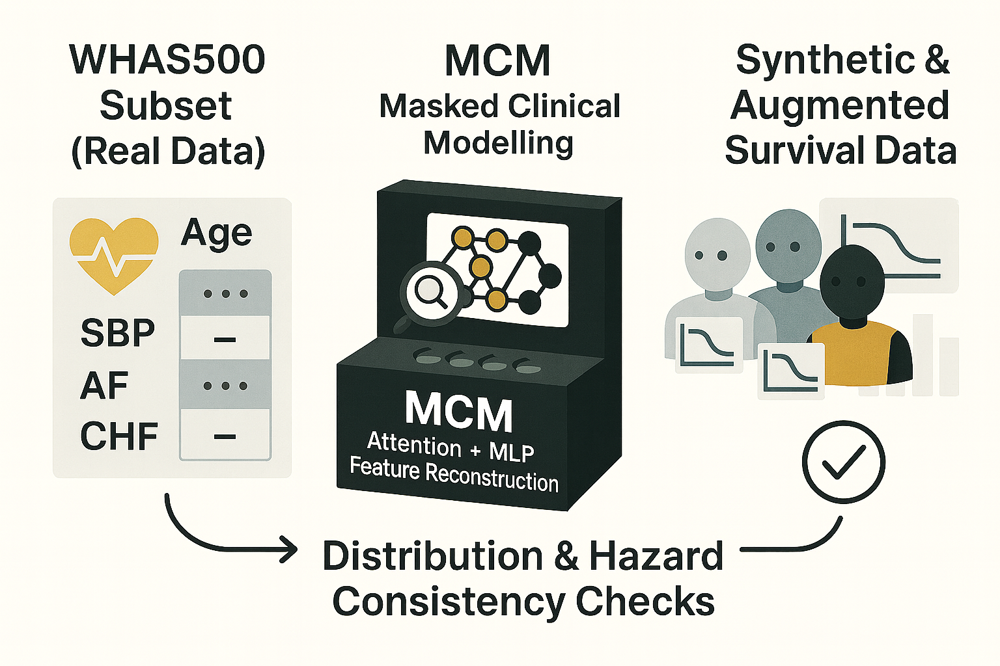
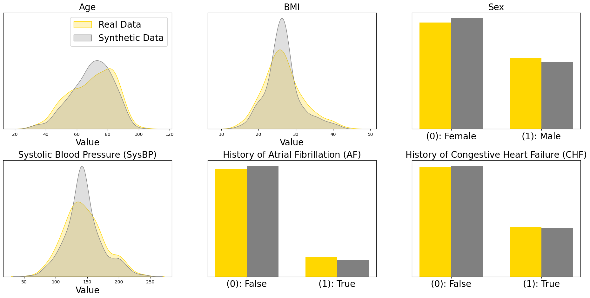
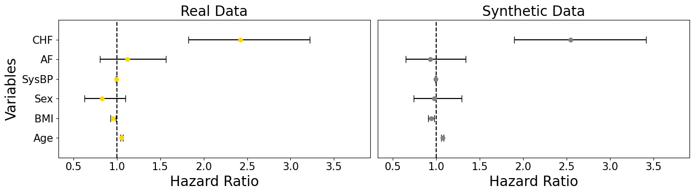

# MCM: A First Look at Survival-Aware Synthetic Data

  

Hey, hello, and Kia Ora!

In this post, we’ll take our very first look at Masked Clinical Modelling (MCM) -- a framework we built to bring the power of BERT-style masked learning into the world of clinical data.

If the [Health Gym v1 model (WGAN-GP)](https://github.com/NicKuo-ResearchStuff/Health_Gym_AI/tree/main/Blogs/Blogs003_HandsOn(HealthGymV1)) focused on realism,
then MCM takes the next step: learning how to make data that both looks real and behaves like real data when used in survival analysis.

---

## About this Example

This notebook is a worked sample designed for readers who want to see how MCM behaves on a small but well-known survival dataset -- [WHAS500](https://scikit-survival.readthedocs.io/en/stable/api/generated/sksurv.datasets.load_whas500.html), which records post–heart attack outcomes for 500 patients.

You can open the accompanying Colab script (in this same folder) and reproduce everything yourself.

---

## What This Workflow Does

At a glance, the MCM process follows five big steps:

1. Load the dataset – use the WHAS500 survival cohort (demographics, vitals, and chronic conditions).
2. Transform and normalise – apply Box–Cox scaling so variables sit on a comparable scale.
3. Mask and learn – randomly hide parts of the data, and let the model reconstruct the missing pieces using an attention-guided MLP.
4. Generate synthetic data – fill masked portions to create a fully synthetic dataset.
5. Check realism and utility – compare not only the distributions but also the hazard ratios to make sure clinical relationships are preserved.

---

## Results

  

After training, we first check the visual fidelity -- this shows how well the synthetic data (grey) matches the real WHAS500 data (gold).

  

Next, we check utility -- on whether those synthetic patients behave like real ones in survival analysis.
We do this by fitting a Cox Proportional Hazards model to both datasets and compare the resulting hazard ratios.

Notice how both sides (real vs synthetic) point in the same directions, *e.g.,* age increases risk (HR > 1). The alignment across these panels shows that MCM not only reproduces realistic shapes,
but also preserves the clinical relationships that drive survival outcomes.

---

## Takeaway

This simple example demonstrates that MCM can:
* Learn realistic feature dependencies,
* Generate clinically coherent synthetic data, and
* Preserve hazard structures used in real survival modelling.

While the results are preliminary, they show how masked learning can be a powerful tool for both synthetic data generation and conditional data augmentation -- generating new records that remain faithful to real-world dynamics.

---

## What’s Next

This worked example is just a first step.
In our upcoming implementation blog series, we’ll unpack the details step by step so you can see exactly how the full system works.

Cheers, 
\- Nic

(Last Edit: 2025-10-15)
