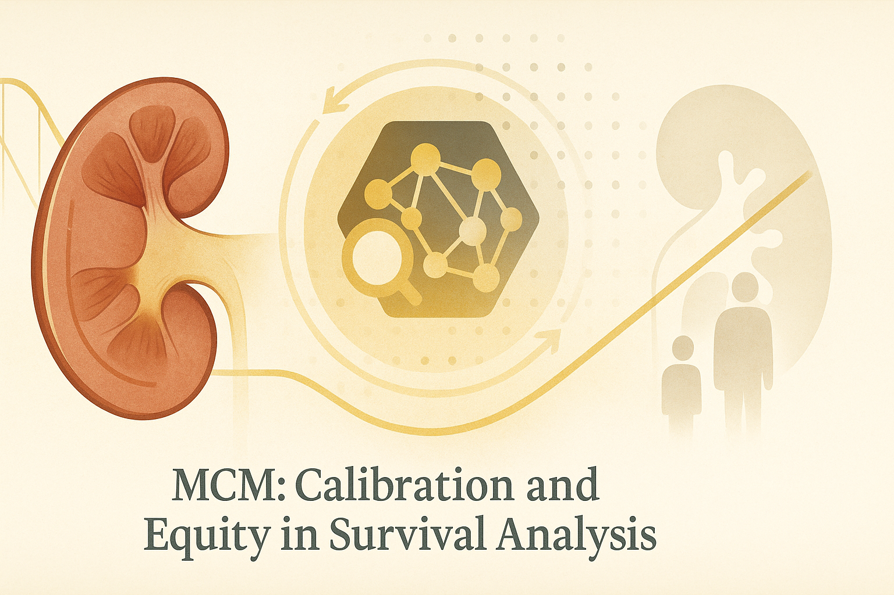
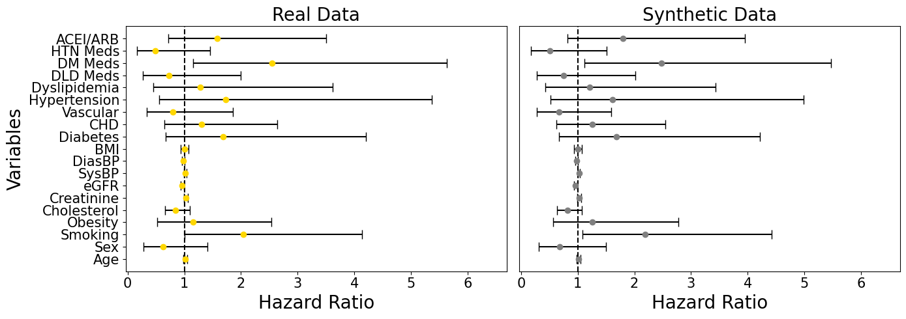

# MCM: Calibration and Equity in Real-World Survival Analysis

  

Hey, hello, and Kia Ora!  

In our [MCM introductory post](https://github.com/NicKuo-ResearchStuff/Masked_Clinical_Modelling/tree/main/Blogs/Blogs0a1_HandsOn(MedInfoPaper)), we explored how Masked Clinical Modelling brings BERT-style masked learning into clinical data, showing that it can generate survival-aware synthetic data that not only looks real, but behaves like real data when used in analysis.  

This time, we take another step forward: 
applying MCM to [a real-world electronic medical record (EMR) dataset on chronic kidney disease (CKD)](https://www.kaggle.com/datasets/davidechicco/chronic-kidney-disease-ehrs-abu-dhabi). 
We test that, beyond realism, does the synthetic dataset has <ins>clinical utility</ins>: 
for instance, can synthetic data improve calibration and fairnessin in clinical prediction models (*e.g.,* [CoxPH](https://github.com/NicKuo-ResearchStuff/Masked_Clinical_Modelling/tree/main/Blogs/Blogs_Z_Implementation/Implementation03)).

---

## Our Aims

We wanted to test whether MCM could:
* Generate realistic patient records (distribution fidelity),
* Preserve hazard relationships used in survival models, and  
* Improve calibration across patient subgroups -- especially those under-represented in real data (older adults, diabetics, renal dysfunction).

---

## What This Workflow Does

Again, all codes are publicly available and you should test it out yourself: 
1. see [Part 1](https://github.com/NicKuo-ResearchStuff/Masked_Clinical_Modelling/blob/main/Blogs/Blogs0a2_HandsOn(JBIPaper)/2025-11-10_(2025_08_16)_B001_MCM_CkdEhr_JbiSpecialIssue.ipynb) 
on how MCM creates synthetic data that captures both the Kaplan–Meier curve and [hazard ratios](https://github.com/NicKuo-ResearchStuff/Masked_Clinical_Modelling/tree/main/Blogs/Blogs_Z_Implementation/Implementation04) in downstream survival analyses.
2. see [Part 2](https://github.com/NicKuo-ResearchStuff/Masked_Clinical_Modelling/blob/main/Blogs/Blogs0a2_HandsOn(JBIPaper)/2025-11-10_(2025_08_16)_B002_MCM_BaselineAugmentation_JbiSpecialIssue.ipynb) 
for baseline comparative methods.
3. see [Part 3](https://github.com/NicKuo-ResearchStuff/Masked_Clinical_Modelling/blob/main/Blogs/Blogs0a2_HandsOn(JBIPaper)/2025-11-10_(2025_08_16)_B003_MCM_McmAugmentation_JbiSpecialIssue.ipynb) 
for data augmentation for calibration testing.

## Results

### Realism

  

First, we compared variable-by-variable distributions between real (gold) and MCM-generated (grey) datasets.  

---

### Utility

  

Next, we checked whether synthetic patients behave like real ones in survival analysis.  

---

### Calibration and Equity

Calibration measures how well predicted risks match observed outcomes.  
By using MCM-generated synthetic subcohorts to augment sparse groups, calibration improved by:
* 15 % overall (global calibration loss reduction), and  
* 9 % across subgroups (meta-calibration improvement).

---

## Takeaway

This real-world CKD study shows that synthetic data can do more than anonymise —  
it canrepair calibrationandstrengthen equityin survival prediction models.

Key insights:

MCM preserves both marginal distributions and hazard relationships.  
Calibration improves for under-represented groups without retraining.  
Works equally well for standalone synthesis and conditional augmentation.  
Outperforms standard oversampling and deep generative baselines in both fidelity and fairness.  

In short — attention helps the model learn who’s missing, not just what’s missing.

---

## What’s Next

We will continue to unpack the details in our upcoming implementation blog series.

Cheers, 
\- Nic

(Last Edit: 2025-11-11)
