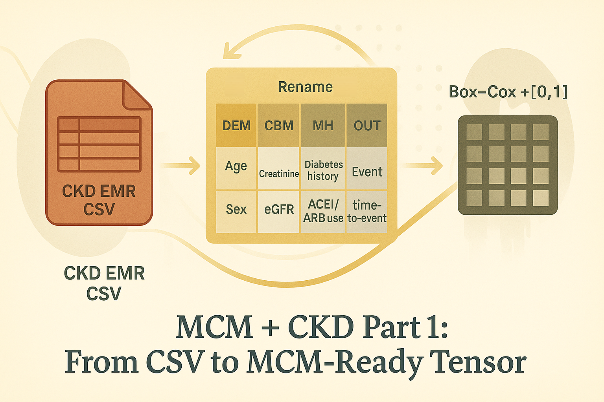

# MCM + CKD Part 1: From Kaggle CSV to MCM-Ready EMR Table

  

Hey, hello, and Kia Ora!

In our [CKD blog](https://github.com/NicKuo-ResearchStuff/Masked_Clinical_Modelling/tree/main/Blogs/Blogs0a2_HandsOn(JBIPaper)), we discussed how we used MCM on a real-world chronic kidney disease (CKD) EMR cohort to ask:</br>
*Can synthetic CKD data help with calibration and equity in survival prediction models?*

In this post, we will not touch neural nets.</br>
We simply take a public CKD baseline cohort and turn it into an MCM-ready tensor:</br>
* semantically labelled,
* clinically interpretable, and
* roughly [0,1]-scaled.

---

## A New Mini-Series
In this new mini-series, we will discuss the details in [the B001 code](https://github.com/NicKuo-ResearchStuff/Masked_Clinical_Modelling/blob/main/Blogs/Blogs0a2_HandsOn(JBIPaper)/2025-11-10_(2025_08_16)_B001_MCM_CkdEhr_JbiSpecialIssue.ipynb) in applying MCM on the CKD cohort.</br>

1. Part 1 (this post)</br>
   Scope: everything up to and including Box–Cox + [0,1] normalisation and why we do it.

2. Part 2</br>
   Scope: distribution and correlation checks, plus KM curves and CoxPH hazard ratios comparing real versus synthetic CKD baselines.

We will not cover the MCM mechanics, because they were previously documented in [here](https://github.com/NicKuo-ResearchStuff/Masked_Clinical_Modelling/tree/main/Blogs/Blogs_Z_Implementation/Implementation06).</br>
The backbone is extremely simple anyway... and what we focus more on, is *how* do we do meaningful ML research in healthcare.

---

## What We’ll Do in Part 1

In this notebook/blog, we will:
* Load the Kaggle CKD EMR baseline extract (`CKD_EHR.csv`),
* Rename and reorder columns into meta-type blocks (DEM / CBM / MH / MED / OUT),
* Briefly explain the clinical meaning of each block,
* Apply Box–Cox transforms to tame long skewed tails, and
* Normalise selected variables into a [0,1]-like range, then convert into a PyTorch tensor.

By the end, we’ll have:
* `MY_DF_TENSOR`: a meta-typed, Box–Coxed, [0,1]-scaled tensor that is ready for MCM processing.

---

## Reproducibility

  ```python
  def seed_everything(seed=42):
      random.seed(seed)
      np.random.seed(seed)
      os.environ['PYTHONHASHSEED'] = str(seed)
      torch.manual_seed(seed)
      torch.cuda.manual_seed(seed)
      torch.cuda.manual_seed_all(seed)
      torch.backends.cudnn.deterministic = True
      torch.backends.cudnn.benchmark = False

  seed_everything()
  ```
This pins the random seeds and cuDNN behaviour.

---

## Loading the CKD EMR Dataset

```python
file_path = "CKD_EHR.csv"
data = pd.read_csv(file_path)
```

Download it from [Kaggle](https://www.kaggle.com/datasets/davidechicco/chronic-kidney-disease-ehrs-abu-dhabi), and load it like.

---

## Meta-Type Renaming (DEM / CBM / MH / MED / OUT)

Next, we turn that flat table into a semantically structured feature set by renaming columns into meta-type groups:

```python
rename_dict = {
    'AgeBaseline': 'DEM_Age',
    'Sex': 'DEM_Sex',
    'HistorySmoking': 'DEM_Smoking_History',
    'HistoryObesity': 'DEM_Obesity_History',

    'CholesterolBaseline': 'CBM_Cholesterol',
    'CreatinineBaseline': 'CBM_Creatinine',
    'eGFRBaseline': 'CBM_eGFR',
    'sBPBaseline': 'CBM_Systolic_BP',
    'dBPBaseline': 'CBM_Diastolic_BP',
    'BMIBaseline': 'CBM_BMI',

    'HistoryDiabetes': 'MH_Diabetes_History',
    'HistoryCHD': 'MH_CHD_History',
    'HistoryVascular': 'MH_Vascular_History',
    'HistoryHTN ': 'MH_Hypertension_History',
    'HistoryDLD': 'MH_Dyslipidemia_History',

    'DLDmeds': 'MED_DLD_Meds',
    'DMmeds': 'MED_Diabetes_Meds',
    'HTNmeds': 'MED_HTN_Meds',
    'ACEIARB': 'MED_ACEI_ARB_Use',

    'EventCKD35': 'OUT_EventCKD35',
    'TimeToEventMonths': 'OUT_TimeToEventMonths'
}

data.rename(columns=rename_dict, inplace=True)
```

The naming convention:

* `DEM_*` -- demographics & lifestyle
* `CBM_*` -- clinical baseline measurements
* `MH_*` -- medical history
* `MED_*` -- medications
* `OUT_*` -- outcome & time-to-event

---

## Pre-processing

MCM will later train a small attention network that masks and reconstructs arbitrary features.</br>
That works best if the features live on reasonably similar numeric scales, without a few wild tails dominating the loss.

First, we define which columns to transform:

```python
from scipy import stats

columns_to_transform = [
    "DEM_Age",
    "CBM_Cholesterol", "CBM_Creatinine", "CBM_eGFR",
    "CBM_Systolic_BP", "CBM_Diastolic_BP", "CBM_BMI",
    "OUT_TimeToEventMonths"
]
```

These are: continuous, non-negative, and often skewed.

We then learn Box–Cox parameters from the original data:

```python
transformation_params = {}

for column in columns_to_transform:
    transformed_col, fitted_lambda = stats.boxcox(my_df[column] + 1)

    transformation_params[column] = {
        'lambda': fitted_lambda,
        'min': transformed_col.min(),
        'max': transformed_col.max() - transformed_col.min()
    }
```

For each variable we keep:
* `λ` (lambda): the Box–Cox shape parameter,
* `min`: minimum of the transformed values,
* `max`: range (= max − min) of the transformed values.
Keeping these information makes the pipeline reversible -- we can later map synthetic values back into original clinical units.

Next, we build a scaled version of the DataFrame:

```python
seed_everything()
import copy
MY_DF = copy.copy(my_df)

for column, params in transformation_params.items():
    MY_DF[column] = MY_DF[column].astype(float)
    MY_DF[column] = stats.boxcox(MY_DF[column] + 1,
                                 lmbda=params['lambda'])
    MY_DF[column] = (MY_DF[column] - params['min']) / params['max']
```

After this:
* Each transformed variable (DEM_Age, key CBM labs, event time) lives roughly in a [0,1]-like range.
* The loss surface later used for masked reconstruction is numerically well-behaved.
* [We can use a single masking scheme across all features and a single sigmoid-style output when reconstructing.](https://github.com/NicKuo-ResearchStuff/Masked_Clinical_Modelling/tree/main/Blogs/Blogs_Z_Implementation/Implementation07)

---

## Converting to an MCM-Ready Tensor

Finally, we move from DataFrame to tensor:

```python
MY_DF_TENSOR = torch.tensor(MY_DF.values, dtype=torch.float32)
```

This is the exact moment where:</br>
`CKD_EHR.csv` becomes an MCM-ready numerical object.

Cheers,</br>
\- Nic

(Last Edit: 2025-11-13)
