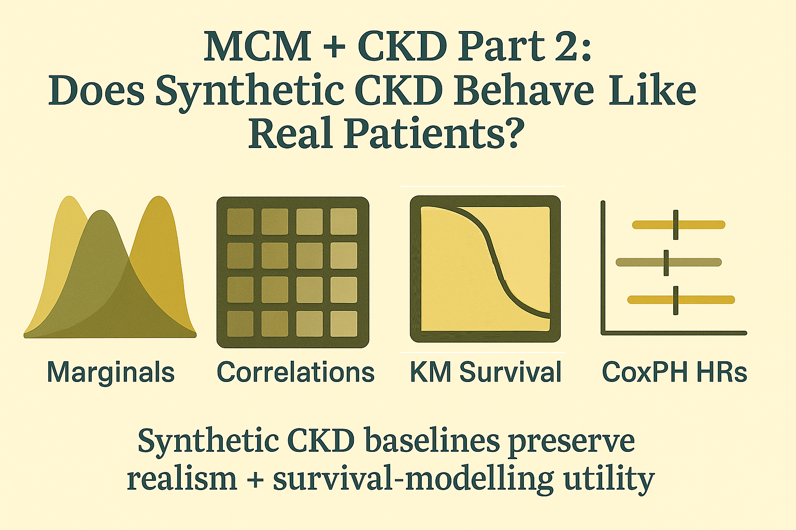
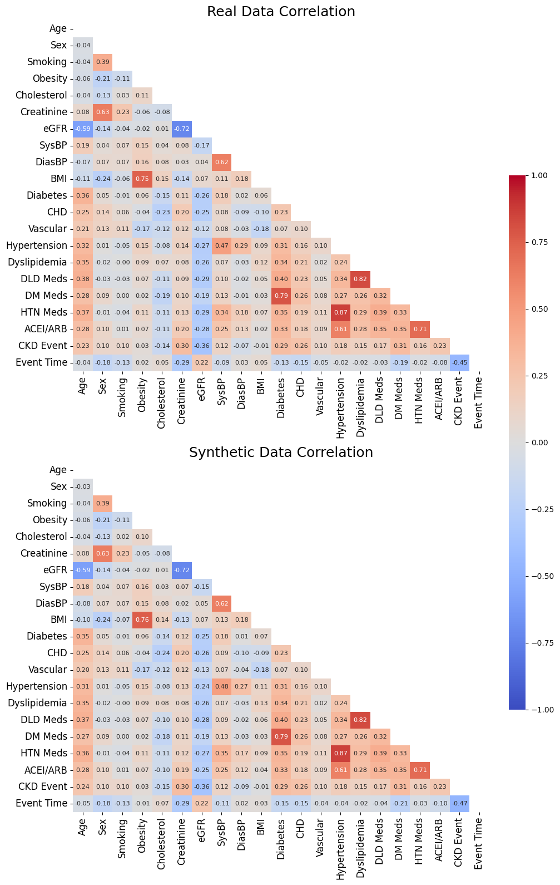
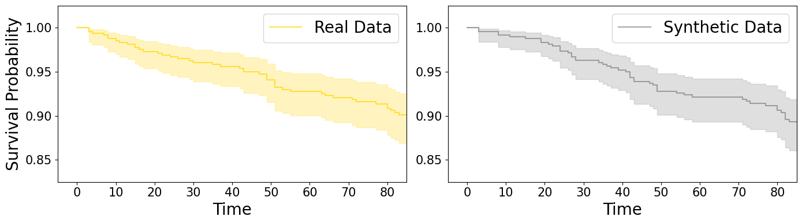

# MCM + CKD Part 2: Does Synthetic CKD Data Behave Like the Real Thing?

Hey, hello, and Kia Ora!

In Part 1, we analysed how we conducted data transformation in our MCM for CKD code of [B001](https://github.com/NicKuo-ResearchStuff/Masked_Clinical_Modelling/blob/main/Blogs/Blogs0a2_HandsOn(JBIPaper)/2025-11-10_(2025_08_16)_B001_MCM_CkdEhr_JbiSpecialIssue.ipynb).

Now we move to the natural next question: 
*After generating synthetic CKD baselines with MCM, do they look, correlate, and behave like the real cohort?*

This post focuses on validation, not modelling:
we examine realism and utility through distributional fidelity, correlation structure, Kaplan–Meier survival profiles, and Cox proportional hazards.

---

# What We’ll Cover in Part 2

1. Distributional realism 
Using KDEs and side-by-side bar plots for all demographic, clinical, history, medication, and outcome variables.
2. Bivariate structure 
Are correlations between renal biomarkers, comorbidities, and medications preserved?
3. Temporal fidelity 
Do survival curves from synthetic data match real CKD progression?
4. Hazard-ratio fidelity 
Do CoxPH models trained on synthetic data reproduce clinically meaningful associations?

The code to generate all results below can be found [here](https://github.com/NicKuo-ResearchStuff/Masked_Clinical_Modelling/blob/main/Blogs/Blogs0a2_HandsOn(JBIPaper)/2025-11-10_(2025_08_16)_B001_MCM_CkdEhr_JbiSpecialIssue.ipynb).

---

# 1. Realism Check (Univariate Fidelity)

We start with 21 clinical variables. 
Using the `variable_mapping` structure, we generate 21 subplots:

Numeric variables → KDE plots (gold = real, grey = synthetic)
Binary variables → side-by-side barplots

 

Across all variables, the alignment is close:

Balanced binaries (*e.g.,* sex, obesity history) match almost exactly. 
Imbalanced binaries (*e.g.,* smoking, CKD events) are preserved despite class imbalance. 
Numeric variables show excellent shape capture: 
- bell-shaped cholesterol
- wide SBP/DBP spread
- near-linear age distribution
- long left-skewed time-to-event durations

Minor negative values in KDE tails arise from smoothing, not from the data itself.

This confirms that MCM preserves marginal distributions across all variable types.

---

# 2. Bivariate Correlation Structure

Next, we compute and visualise correlation matrices for real and synthetic datasets:

The structure remains highly consistent:

Strong negative associations such as
- eGFR ↔ Creatinine

are preserved.

Comorbidity clusters, like
- Hypertension ↔ HTN medication
- Diabetes ↔ DM medication

remain intact.

This suggests that MCM reconstructs inter-variable relationships, not just univariate shapes.

Correlation fidelity is crucial: 
without it, survival models trained on synthetic data would misrepresent risk structure.

---

# 3. Survival Fidelity (Kaplan–Meier Curves)

We then compare survival trajectories derived from real versus synthetic CKD EMRs:

The KM curves reflect:
- Final survival level
- Slope / event rate dynamics
- Interval-specific variability

All three characteristics are reproduced in synthetic data:
- The long-term survival probability matches closely.
- The drop-off pattern (representing CKD progression) is nearly identical.
- Confidence intervals overlap without divergence.

This shows that MCM preserves the temporal structure of CKD progression.

---

# 4. CoxPH Utility Check (Hazard-Ratio Consistency)

Finally, we fit Cox proportional hazards models on:
- the real CKD cohort, and
- the synthetic cohort generated by MCM.

We compare hazard ratios and 95% CIs:

Findings:
- Effect directions remain consistent across datasets.
- Effect magnitudes (HRs) align closely.
- Important variables (age, eGFR, diabetes status) retain their expected associations with CKD progression.
- Confidence intervals show concordant patterns of uncertainty.

This is the strongest indicator that MCM-generated CKD data maintain clinical utility.

---

# What’s Next

In the next post, we will: 
review how superficial marginal distribution realisms are.

Cheers, 
\- Nic

(Last Edit: 2025-11-14)
