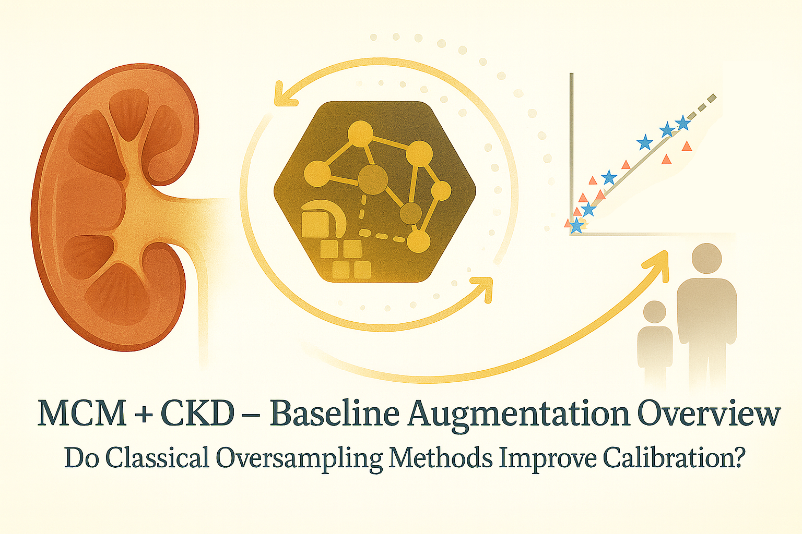

# MCM + CKD — Baseline Augmentation Overview: How Well Do Classical Oversampling Methods Improve Calibration?

Hey, hello, and Kia Ora!

In [B001](https://github.com/NicKuo-ResearchStuff/Masked_Clinical_Modelling/blob/main/Blogs/Blogs0a2_HandsOn(JBIPaper)/2025-11-10_(2025_08_16)_B001_MCM_CkdEhr_JbiSpecialIssue.ipynb), we prepared the Kaggle CKD EMR dataset, turned it into an MCM-ready tensor, and tested whether MCM-generated synthetic CKD baselines behave like the real cohort -- preserving distributions, correlations, Kaplan–Meier survival, and CoxPH hazard ratios.

Now we shift gears.

Before using MCM for calibration and equity improvements, it is important to ask a fair and honest baseline question:

*If we simply apply off-the-shelf ML oversampling methods, can they fix subgroup calibration in CKD survival models just as well as MCM?*

This is what [B002](https://github.com/NicKuo-ResearchStuff/Masked_Clinical_Modelling/blob/main/Blogs/Blogs0a2_HandsOn(JBIPaper)/2025-11-10_(2025_08_16)_B002_MCM_BaselineAugmentation_JbiSpecialIssue.ipynb) tackles.

It is the non-MCM competitor engine for [our JBI paper](https://www.sciencedirect.com/science/article/pii/S1532046425001571) -- a full benchmark of how classical oversampling performs when used to augment under-represented clinical subgroups before fitting Cox proportional hazards models.

Below is an overview of what B002 does and how we will unpack it in a dedicated 5-part code-explanation mini-series.

---

# 1. What B002 Is About

At its core, [B002](https://github.com/NicKuo-ResearchStuff/Masked_Clinical_Modelling/blob/main/Blogs/Blogs0a2_HandsOn(JBIPaper)/2025-11-10_(2025_08_16)_B002_MCM_BaselineAugmentation_JbiSpecialIssue.ipynb) builds synthetic CKD subcohorts using classical oversampling (RandomOverSampler, SMOTE, SMOTENC, ADASYN, BorderlineSMOTE, SVMSMOTE) and tests:
* Do these synthetic data improve calibration (slope, D21)?
* Across which subgroups (*e.g.,* older adults, low eGFR, hypertension, obesity, CVD, lipids)?
* At which time points in survival analysis (25th / 50th / 75th percentile follow-ups)?
* And how do these improvements compare to MCM-based augmentation? 
(B003, to be discussed in the future...)

This script forms the “competing baseline” half of the JBI pipeline.

---

# 2. A Human-Readable Walkthrough

### (a) Clinical stratification of the CKD cohort

We begin by deriving clinically meaningful subgroup flags:
* Age (Older / Younger)
* Kidney function (eGFR Normal / Non-Ideal)
* Diabetes (with meds / without / none)
* BP level, Obesity, CVD, Lipid dysfunction

And then collapse them into binary flags (*e.g.,* `Strat_Dia_Fin`, `Strat_Hyper_Fin`)

The script stores prevalence ratios for each subgroup — revealing imbalance patterns that often cause calibration problems.

---

### (b) Baseline CoxPH with fold-swap validation

Before augmentation, we build a 5-fold, 2-way fold-swap CoxPH engine:
* Train on half of the cohort
* Predict on the other half
* Swap, repeat
* Save out-of-fold linear predictor scores (LPH)

This produces a baseline CKD risk model for each patient, with no data leakage.

---

### (c) Synthetic CKD subcohorts using classical oversampling

For each stratification variable (e.g., `Strat_Age`) and each value (0 or 1):
* Sample 50% of the dataset
* Keep only the subgroup
* Apply oversampling to balance CKD events using:
    1. RandomOverSampler
    2. SMOTE
    3. SMOTENC
    4. ADASYN
    5. BorderlineSMOTE
    6. SVMSMOTE
* Clean data types (binary thresholding, rounding clinical measures)
* Store 5 synthetic subcohort replicas for stability

This produces dozens of synthetic subcohorts per method.

---

### (d) Fit augmented Cox models

For each subgroup + each method:
* Combine real data + synthetic subgroup data
* Fit CoxPH under the same fold-swap structure
* Save new augmented LPH predictions

This mirrors the baseline pipeline, allowing clean comparisons.

---

### (e) Compute calibration metrics

Calibration is evaluated using:
* Calibration slope (ideal = 1)
* D21 error = |1 − slope|

Calculated at:
* 25% survival time
* 50% survival time
* 75% survival time

This is done for every subgroup, for both real and augmented predictions.

---

### (f) Compare performance across methods

For each subgroup (`Strat_Age_1`, `Strat_eGFR_0`, `Strat_CVD_1`, …):
* Print baseline calibration
* Print augmented calibration (mean ± SD)
* Identify helpful vs harmful oversampling approaches

This provides a full competitor benchmark against which MCM augmentation (in B003) is evaluated.

---

# What’s Next

Because B002 is large and conceptually rich, we will walk through it over five dedicated posts, each focusing on one logical block:
* Part 1 — Stratifying the CKD Cohort for Calibration
* Part 2 — Building the 5×2 Fold-Swap CoxPH Engine
* Part 3 — Oversampling 101: Generating Classical Synthetic CKD Subcohorts
* Part 4 — Training Cox Models on Augmented Subgroups
* Part 5 — Calibration Metrics Across Subgroups and Time

Cheers, 
\- Nic

(Last Edit: 2025-11-17)
