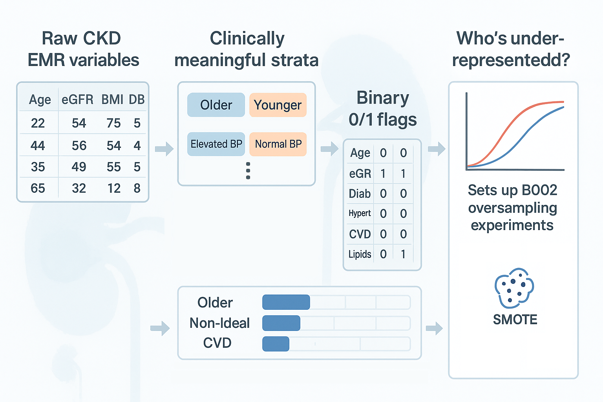

# MCM + CKD B002 — Part 1:</br> Stratifying the CKD Cohort for Calibration



Hey, hello, and Kia Ora!

This is the first blog towards understanding the [B002](https://github.com/NicKuo-ResearchStuff/Masked_Clinical_Modelling/blob/main/Blogs/Blogs0a2_HandsOn(JBIPaper)/2025-11-10_(2025_08_16)_B002_MCM_BaselineAugmentation_JbiSpecialIssue.ipynb) source code.

The idea of this code is to create a fair comparison baseline, using established off-the-shelf methods that mitigate data imbalancess, and see if they fix subgroup calibration in Cox models.

In order to ask that question, we first need to decide which subgroups we care about.

We focus on stratifications in
* kidney function,
* diabetes,
* blood pressure,
* age, and
* cardiovascular disease
because these axes are well-established drivers of CKD progression and mortality</br>
(see [Appendix D of our JBI paper](https://www.sciencedirect.com/science/article/pii/S1532046425001571#s0130) for clinical rationale and references).

This post walks through the code that:

1. turns raw EMR columns into interpretable subgroup labels,
2. collapses those labels into binary 0/1 flags, and
3. summarises how imbalanced each subgroup is.

These binary flags are the backbone for everything that follows: oversampling, conditional augmentation, and subgroup-specific calibration.

---

## 1. From raw EMR columns to human-readable strata

We start by working on a copy of the cleaned CKD DataFrame:

```python
my_df2 = copy.copy(my_df)
```

This keeps the original `my_df` intact for other analyses.

### Helper: a generic category → binary function

We define a small helper to collapse categorical labels into 0/1 indicators:

```python
def convert_to_binary(series, positive_conditions):
    return series.apply(lambda x: 1 if x in positive_conditions else 0)
```

Input: a categorical series (*e.g.,* `"Older"` / `"Younger"`).</br>
Output: `1` if the value is in `positive_conditions`, otherwise `0`.</br>

We’ll reuse this for most of our stratification variables.</br>

---

## 2. Building categorical stratification variables

Next, we construct human-readable strata from the EMR columns. Each block is designed to reflect how a clinician would think about risk.

### Example: Age -- Younger vs Older

```python
my_df2['Strat_Age'] = my_df2['DEM_Age'].apply(
    lambda x: 'Older' if x >= 65 else 'Younger'
)
```

* Older: age ≥ 65
* Younger: age < 65

Age is a major non-modifiable CKD risk factor, with natural declines in nephron function and higher comorbidity burdens accelerating renal deterioration.

---

### Example: Diabetes -- triangulating history and medication

```python
my_df2['Strat_Diabetes'] = my_df2.apply(
    lambda row: 'Diabetes With Medication'
        if row['MH_Diabetes_History'] == 1 and row['MED_Diabetes_Meds'] == 1 else
        'Diabetes Without Medication'
        if row['MH_Diabetes_History'] == 1 else
        'No Diabetes',
    axis=1
)
```

We define three categories:
* Diabetes With Medication: diabetes history = 1 and diabetes meds = 1
* Diabetes Without Medication: diabetes history = 1, meds = 0
* No Diabetes: no recorded history

Diabetes is a primary global driver of CKD, where chronic hyperglycemia accelerates glomerular injury and fuels progressive renal decline.

---

## 3. Composite “final” binary flags

Some downstream analyses care only about presence vs absence, not the medication breakdown. We therefore define composite flags, such as:

```python
my_df2['Strat_Dia_Fin'] = my_df2['Strat_Diabetes'].apply(
    lambda x: 1 if x != 'No Diabetes' else 0
)
```

Strat_Dia_Fin = 1 → any diabetes (with or without meds)</br>
The 0/1 flag makes it convenient for oversampling and stratified calibration.

---

## 4. Collapsing categorical strata into binary 0/1 indicators

We now convert the human-readable labels into binary indicators using `convert_to_binary`:

```python
my_df2['Strat_Age']          = convert_to_binary(my_df2['Strat_Age'], ['Older'])
my_df2['Strat_Diabetes']     = convert_to_binary(my_df2['Strat_Diabetes'],
                                                 ['Diabetes With Medication', 'Diabetes Without Medication'])
```

---

## 5. Quantifying subgroup imbalance: who’s under-represented?

After defining the flags, we ask a simple but crucial question:</br>
How many patients fall into each group?

We use `value_counts(normalize=True)` to calculate proportions:

```python
strat_age_ratio           = my_df2['Strat_Age'].value_counts(normalize=True)
strat_diabetes_ratio      = my_df2['Strat_Diabetes'].value_counts(normalize=True)
```

We then assemble these into a tidy dictionary and table:

```python
ratios = {
    "Strat_Age": strat_age_ratio,
    "Strat_Dia_Fin": strat_diabetes_ratio,
}

```

Finally we find that

### CKD Stratification Definitions and Proportions

| **Stratification** | **Proportion**                                    | **Notes on Stratification**                                                                                                                                                                                                     |
| ------------------ | -------------------------------------------------------------------------------------- | ------------------------------------------------------------------------------------------------------------------------------------------------------------------------------------------ |
| **eGFR**           | Normal (67.21%)</br>Non-Ideal (32.79%)             | eGFR was stratified into</br> *Normal* (≥ 90 mL/min/1.73 m²) and</br> *Non-Ideal* (< 90 mL/min/1.73 m²).                                                                                                                                  |
| **Diabetes**       | No Diabetes (56.21%)</br>Diabetes (43.79%)         | Diabetes status was determined through triangulation:</br> patients were first classified as</br> *No Diabetes*, *Diabetes Without Medication*, or *Diabetes With Medication*,</br> then collapsed into a binary category.                     |
| **Hypertension**   | No Hypertension (31.77%)</br>Hypertension (68.23%) | Hypertension incorporated medication use (ACE inhibitors or ARBs).</br> Patients were classified as</br> *No Hypertension*, *Hypertension Without Medication*, or *Hypertension With Medication*,</br> then collapsed into a binary indicator. |
| **Age**            | Younger (77.19%)</br>Older (22.81%)                | Age was stratified into</br> *Younger* (< 65 years) and</br> *Older* (≥ 65 years).                                                                                                                                                        |
| **CVD**            | No CVD (86.15%)</br>CVD (13.85%)                   | CVD status was defined by</br> a history of coronary heart disease or vascular disease.                                                                                                                                              |


Cheers,</br>
\- Nic

(Last Edit: 2025-11-18)
