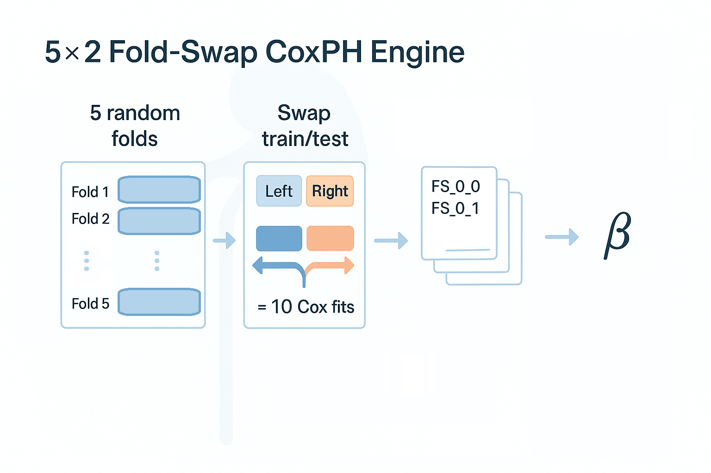

# MCM + CKD B002 — Part 2:</br> Building the 5×2 Fold-Swap CoxPH Engine



Hey, hello, and Kia Ora!

Welcome back to our guided walkthrough of the [B002 baseline augmentation pipeline](https://github.com/NicKuo-ResearchStuff/Masked_Clinical_Modelling/blob/main/Blogs/Blogs0a2_HandsOn(JBIPaper)/2025-11-10_(2025_08_16)_B002_MCM_BaselineAugmentation_JbiSpecialIssue.ipynb).

In [Part 1](https://github.com/NicKuo-ResearchStuff/Masked_Clinical_Modelling/tree/main/Blogs/Blogs_X_Implementation/Blog_CKD_UnderstandingB002_Part02), we turned raw CKD EMR variables into clinically meaningful stratification flags.</br>
Those binary indicators now allow us to evaluate calibration within subgroups such as older adults, diabetics, and patients with low eGFR.

Before we can test whether classical oversampling improves subgroup calibration, we need a consistent, leak-free, reproducible Cox model that serves as the baseline.

---

# 1. Why a Fold-Swap Engine?

Calibration must always be assessed out-of-sample.

If we fit a Cox model and predict on the same patients, calibration will be misleadingly optimistic.</br>
To avoid information leakage, B002 uses a simple but powerful design:</br>
*5 folds × 2 directions = 10 out-of-sample predictions per patient*

Each fold randomly splits the CKD cohort into:
* 50% training set
* 50% test set

Then we swap the roles:
* train on the left half, predict on the right
* train on the right half, predict on the left

This is repeated five times to stabilise variability.

In the end, every patient receives multiple out-of-fold linear predictor scores, which we later average to form their baseline risk estimate.

---

# 2. Preparing the Modelling Dataset

We first extract the predictors, outcome, and stratification flags into a clean dataframe:

```python
data_copy = copy.copy(my_df2)

covariate_cols = [
   'DEM_Age', 'DEM_Sex', 'DEM_Smoking_History', 'DEM_Obesity_History',
   'CBM_Cholesterol', 'CBM_Creatinine', 'CBM_eGFR', 'CBM_Systolic_BP',
   'CBM_Diastolic_BP', 'CBM_BMI', 'MH_Diabetes_History', 'MH_CHD_History',
   'MH_Vascular_History', 'MH_Hypertension_History',
   'MH_Dyslipidemia_History', 'MED_DLD_Meds', 'MED_Diabetes_Meds',
   'MED_HTN_Meds', 'MED_ACEI_ARB_Use'
]

time_col  = 'OUT_TimeToEventMonths'
event_col = 'OUT_EventCKD35'

Strat_col = ['Strat_Age', 'Strat_eGFR', 'Strat_BP_Level', 'Strat_Obesity',
             'Strat_CVD', 'Strat_Dia_Fin', 'Strat_Hyper_Fin', 'Strat_Lipid_Fin']

my_Selected = covariate_cols + [time_col, event_col] + Strat_col
Calibration_df = data_copy[my_Selected].copy()
```

This gives us a tidy table with:
* 20 CoxPH predictors
* survival outcome
* 8 subgroup flags

Everything needed for prediction and calibration.

---

# 3. Constructing the 5×2 Fold-Swap Structure

For each of the 5 folds, we generate a 50/50 split using stratified sampling by the CKD event:

```python
num_folds = 5
for i in range(num_folds):
    df_trn, df_tst = train_test_split(
        Calibration_df,
        test_size=0.5,
        stratify=Calibration_df[event_col]
    )

    Calibration_df.loc[df_trn.index, f"FOLD_{i}"] = 0
    Calibration_df.loc[df_tst.index, f"FOLD_{i}"] = 1
```

This produces five new columns:

```
FOLD_0, FOLD_1, FOLD_2, FOLD_3, FOLD_4
```

where each cell contains either:
* 0 → “left half” for that fold
* 1 → “right half” for that fold

These assignments fully determine all train/test operations in the pipeline.

---

# 4. Fitting CoxPH Models Without Leakage

Now we use these fold labels to run the core engine:

```python
def process_data_base(Calibration_df):
    file_suffix = "original"
    PredictorCols = covariate_cols

    for fold in range(num_folds):
        for swap in range(2):

            # TRAIN on the opposite side of the swap
            train_idx = (Calibration_df[f"FOLD_{fold}"] == (1 - swap))
            x = Calibration_df.loc[train_idx, PredictorCols]
            time  = Calibration_df.loc[train_idx, time_col]
            event = Calibration_df.loc[train_idx, event_col]

            tim = x.copy()
            tim["TIME"]  = time
            tim["EVENT"] = event

            cph = CoxPHFitter(penalizer=0.01)
            cph.fit(tim, duration_col='TIME', event_col='EVENT')
```

Here is the crucial logic:

| swap | Training Set | Prediction Set |
| ---- | ------------ | -------------- |
| 0    | FOLD = 1     | FOLD = 0       |
| 1    | FOLD = 0     | FOLD = 1       |

Each fold produces two independent CoxPH fits, generating out-of-fold predictions for everyone.

---

# 5. Producing Out-of-Sample Linear Predictor Scores

After fitting, we compute test-set predictions:

```python
test_idx = (Calibration_df[f"FOLD_{fold}"] == swap)
x = Calibration_df.loc[test_idx, PredictorCols]

df_cox = pd.DataFrame(
    {"LPH": np.dot(x - cph._norm_mean.values, cph.params_)}
)

df_cox.to_csv(f"CKD_FoldSwap_{fold}_{swap}_{file_suffix}.csv")
```

Each file contains:
* the linear predictor (LPH) = βᵀ(x − x̄)
* for just the test patients
* from just one training direction
* within just one fold

Across all 10 (5×2) runs, every patient gets multiple out-of-sample predictions.

Later, we average them to form the baseline CKD risk estimates used by the calibration engine.

Cheers,</br>
\- Nic

(Last Edit: 2025-11-19)
