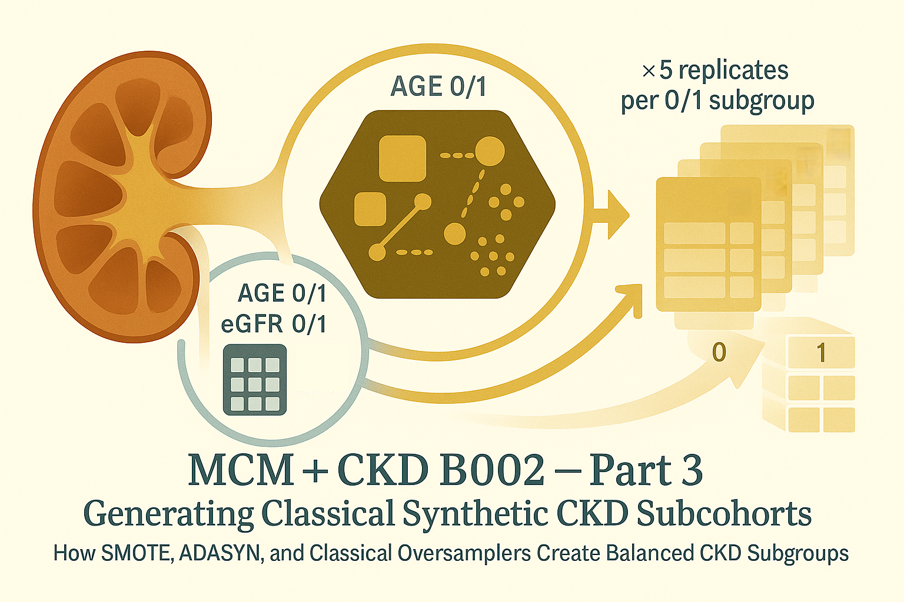

# MCM + CKD B002 — Part 3:</br> Generating Classical Synthetic CKD Subcohorts



Hey, hello, and Kia Ora!

Welcome back to our [B002 baseline augmentation](https://github.com/NicKuo-ResearchStuff/Masked_Clinical_Modelling/blob/main/Blogs/Blogs0a2_HandsOn(JBIPaper)/2025-11-10_(2025_08_16)_B002_MCM_BaselineAugmentation_JbiSpecialIssue.ipynb) walkthrough.

In [Part 2](https://github.com/NicKuo-ResearchStuff/Masked_Clinical_Modelling/tree/main/Blogs/Blogs_X_Implementation/Blog_CKD_UnderstandingB002_Part03), we constructed the 5×2fold-swap CoxPH engine -- giving each patient a leak-free, out-of-sample linear predictor (LPH).

Now we ask:</br>
*How do we setup a unified pipeline to use classical methods to generate synthetic CKD subcohorts?*

This post explains what B002 does under the hood to create machine-learning baselines that will later compete with MCM augmentation.

---

## 1. Why Oversample CKD Subgroups?

Survival datasets are messy and unbalanced, especially that:
* older adults have more events,
* low-eGFR patients have higher baseline risks,
* some subgroups contain only a handful of CKD events.

This imbalance causes poor subgroup calibration:</br>
models under-predict high-risk groups and over-predict low-risk groups.

Classical ML oversamplers aim to fix this by generating synthetic minority samples.</br>
But do they actually help in a time-to-event context?

To test that fairly, B002 builds synthetic datasets using six well-known oversamplers:
1. RandomOverSampler
2. SMOTE
3. SMOTENC
4. ADASYN
5. BorderlineSMOTE
6. SVMSMOTE

Each of these methods has a distinct strategy -- from naive duplication to nearest-neighbour interpolation.</br>
But their pipeline within B002 is intentionally identical.

---

## 2. The Oversampling Template

### (a) Select a stratification variable

Example:
`Strat_Age`, `Strat_eGFR`, `Strat_CVD`, `Strat_Obesity`, `Strat_Lipid_Fin`…

Each represents a clinically meaningful subgroup.

```python
for Cur_Strat in list(ratios.keys()):
```

### (b) Loop through values 0 and 1

For example:

`Strat_Age = 0` → Younger
`Strat_Age = 1` → Older

```python
for now01 in [0, 1]:
```

### (c) Create 5 independent replicates

Oversampling is inherently stochastic.</br>
To stabilise noise, B002 generates five synthetic subcohort variants per subgroup/value pair.


```python
while successful_iterations < 5:
```
### (d) The actual oversampling logic

Within each replicate:

#### Step 1 — randomly sample 50% of the CKD dataset

```python
my_df2_sampled = my_df2.sample(frac=0.5, random_state=now_cur_itr)
```

This increases diversity across iterations.

#### Step 2 — filter to only the target subgroup

```python
cur_Loc = np.where(my_df2_sampled[Cur_Strat].values == now01)[0]
cur_strated_df = my_df2_sampled.iloc[cur_Loc, :]
```

So for `Strat_eGFR = 1`, we keep only Non-Ideal kidney function patients.

#### Step 3 — oversample by CKD event imbalance

Outcome:

```python
y = cur_strated_df['OUT_EventCKD35']
```

Apply your chosen oversampler:

```python
SampySamp = RandomOverSampler(...)
X_resampled, y_resampled = SampySamp.fit_resample(cur_strated_df, y)
```

This balances events vs non-events within the subgroup.

#### Step 4 — store in a dictionary

```python
All_Synth_Data_50PC_RandomOverSampler[f"{Cur_Strat}_{now01}_{successful_iterations}"] = synth_data_df
```

where

```
Strat variable   subgroup value      replicate number
   Strat_Age   _        1         _          3
```

We do this across:</br>
all subgroups, all 0/1 values, all 5 replicates, and all oversampling methods</br>
and thus B002 helps us to define a high-standard baseline for calibration benchmarking.

---

# 3. Why the SMOTE / ADASYN / SMOTENC Code Looks Identical

Because only the oversampling algorithm changes. Everything else must remain constant.

This ensures that when calibration improves (or worsens),</br>
you canconfidently attribute that change to the oversampler alone.

For example, SMOTE replaces one line:

```python
SampySamp = SMOTE(
    sampling_strategy='auto',
    random_state=now_cur_itr,
    k_neighbors=min(3, len(cur_Loc) - 1)
)
```

But the:
* subgroup sampling
* 50% resampling
* replicate logic
* dictionary layout

all stay identical.

This ensures controlled experimentation.

Cheers,</br>
\- Nic

(Last Edit: 2025-11-20)
