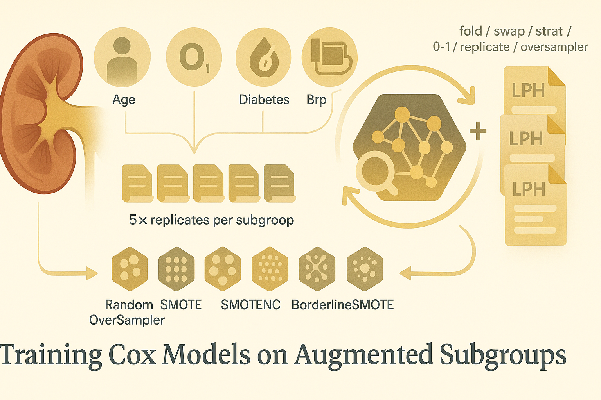

# MCM + CKD B002 — Part 4:</br>Training Cox Models on Augmented Subgroups



Hey, hello, and Kia Ora!

In [Part 3](https://github.com/NicKuo-ResearchStuff/Masked_Clinical_Modelling/tree/main/Blogs/Blogs_X_Implementation/Blog_CKD_UnderstandingB002_Part04), we built six families of classical synthetic CKD subcohorts -- RandomOverSampler, SMOTE, SMOTENC, ADASYN, BorderlineSMOTE, and SVMSMOTE -- each generating five stochastic replicas for every subgroup and subgroup value.

These synthetic datasets now form the “augmentation pool.”

This post will show how we integrating synthetic subcohorts into the CoxPH modelling pipeline, while preserving the exact 5×2 fold-swap structure introduced in [Part 2](https://github.com/NicKuo-ResearchStuff/Masked_Clinical_Modelling/tree/main/Blogs/Blogs_X_Implementation/Blog_CKD_UnderstandingB002_Part03).

To evaluate calibration fairly, everything must be leak-free, reproducible, and identical to the baseline except for one thing:</br>
the synthetic data that we inject.

---

## 1. Before Augmentation: The Baseline Cox Engine

```python
def process_data_base(Calibration_df):
    file_suffix = "original"
    PredictorCols = covariate_cols

    for fold in range(num_folds):
        for swap in range(2):
            idx = (Calibration_df[f"FOLD_{fold}"] == (1 - swap))
            x = Calibration_df.loc[idx, PredictorCols]
            time  = Calibration_df.loc[idx, time_col]
            event = Calibration_df.loc[idx, event_col]

            tim = pd.DataFrame(x)
            tim["TIME"] = time
            tim["EVENT"] = event

            cph = CoxPHFitter(penalizer=0.01)
            cph.fit(tim, duration_col='TIME', event_col='EVENT')

            # Predict on the opposite half
            idx = (Calibration_df[f"FOLD_{fold}"] == swap)
            x = Calibration_df.loc[idx, PredictorCols]

            df_cox = pd.DataFrame(
                {"LPH": np.dot(x - cph._norm_mean.values, cph.params_)}
            )
            df_cox.to_csv(f"CKD_FoldSwap_{fold}_{swap}_{file_suffix}.csv")
```

This baseline does:
* It refits a CoxPH model for every fold and both swap directions.
* Training uses only the real CKD EMR dataset.
* Predictions are strictly out-of-fold, ensuring no information leakage.

---

## 2. After Augmentation: Adding Synthetic Subcohorts to the Cox Model

Now we upgrade to the augmented function:

```python
def process_data_stratified(Calibration_df, Current_AUG, NAME):
    PredictorCols = covariate_cols

    for Cur_Strat in list(ratios.keys()):
        print("###===######===######===###")
        print(Cur_Strat)

        for now01 in [0, 1]:
            for now_cur_itr in range(5):
                Cur_keys = f"{Cur_Strat}_{now01}_{now_cur_itr}"
                file_suffix = "augmented_" + Cur_keys

                for fold in range(num_folds):
                    for swap in range(2):

                        idx = (Calibration_df[f"FOLD_{fold}"] == (1 - swap))
                        x = Calibration_df.loc[idx, PredictorCols]
                        time  = Calibration_df.loc[idx, time_col]
                        event = Calibration_df.loc[idx, event_col]

                        tim = pd.DataFrame(x)
                        tim["TIME"] = time
                        tim["EVENT"] = event

                        cph = CoxPHFitter(penalizer=0.01)

                        # Add synthetic subgroup data into the training half
                        synth_data_df = Current_AUG[Cur_keys]
                        tim_synth          = synth_data_df[PredictorCols]
                        tim_synth["TIME"]  = synth_data_df[time_col]
                        tim_synth["EVENT"] = synth_data_df[event_col]

                        cph.fit(pd.concat([tim, tim_synth]),
                                duration_col='TIME', event_col='EVENT')

                        # Predict on the opposite half
                        idx = (Calibration_df[f"FOLD_{fold}"] == swap)
                        x = Calibration_df.loc[idx, PredictorCols]

                        df_cox = pd.DataFrame(
                            {"LPH": np.dot(x - cph._norm_mean.values, cph.params_)}
                        )
                        df_cox.to_csv(f"CKD_FoldSwap_{fold}_{swap}_{file_suffix}_{NAME}.csv")
```
For every:
* stratification (Age, eGFR, Diabetes, BP, etc.)
* subgroup value (0 or 1)
* augment replicate (five stochastic samples)
* fold (5)
* swap direction (2)

the engine:
1. Extracts the real training half of the fold,
2. Appends a synthetic subcohort for that subgroup,
3. Fits anewCoxPH model to this augmented dataset,
4. Predicts out-of-fold risk on the opposite half,
5. Saves these predictions with a detailed filename indicating:
   * fold
   * swap
   * subgroup
   * 0/1 value
   * replicate
   * oversampler name

These files are theaugmented LPH predictionsthat feed into Part 5’s calibration analysis.

---

## 3. Why We Run the Same Procedure for Every Oversampler

You’ll see repeated calls like:

```python
seed_everything()
process_data_stratified(Calibration_df,
                        Current_AUG = All_Synth_Data_50PC_RandomOverSampler,
                        NAME = "RandomOverSampler")
```

and then:

```python
seed_everything()
process_data_stratified(Calibration_df,
                        Current_AUG = All_Synth_Data_50PC_SMOTE,
                        NAME = "SMOTE")
```

This fairly compare classical oversamplers against each other, and later against MCM.</br>
As indicative of the arguments of `Current_AUG` and `NAME`,</br>
The only difference between the calls is:</br>
*Which synthetic samples are being injected into the training half.*

Cheers,</br>
\- Nic

(Last Edit: 2025-11-21)

