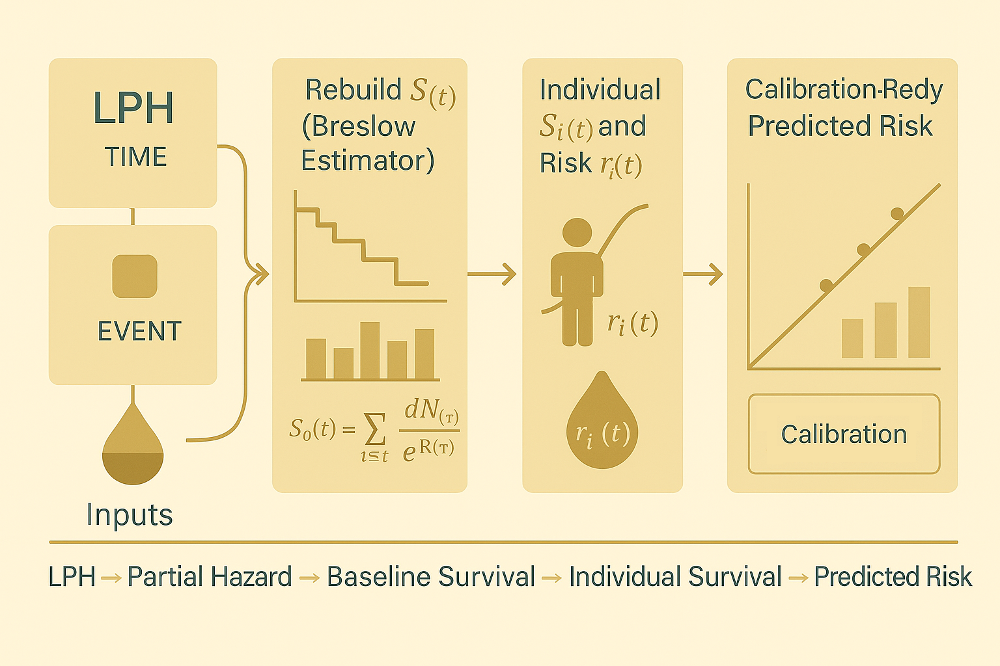

# MCM + CKD B002 — Part 5.1:</br> Deriving the Risk Score with EvalSurv



Hey, hello, and Kia Ora!

Now that [Part pre-5](https://github.com/NicKuo-ResearchStuff/Masked_Clinical_Modelling/tree/main/Blogs/Blogs_X_Implementation/Blog_CKD_UnderstandingB002_Part06) has walked us through what calibration means, we can finally look under the hood and explore how we actually compute predicted survival and risk, using nothing more than the model’s linear predictors (LPH).

We will go through the `EvalSurv` class in code [B002](https://github.com/NicKuo-ResearchStuff/Masked_Clinical_Modelling/blob/main/Blogs/Blogs0a2_HandsOn(JBIPaper)/2025-11-10_(2025_08_16)_B002_MCM_BaselineAugmentation_JbiSpecialIssue.ipynb).

This class does three things:
1. Reconstructs the baseline survival curve $S_0(t)$
2. Rebuilds the individual survival curve $S_i(t)$
3. Converts survival into predicted risk so we can measure calibration properly

---

## 1. Why Do We Need `EvalSurv`?

In the B002 workflow, every CoxPH model is trained using fold-swap cross-fitting:
* 5 folds × 2 swaps
* Each patient receives 10 out-of-sample predictions
* We only store their LPH, not the fitted model object

But to evaluate calibration, we need:
* survival curves
* predicted risk at different time horizons
* risk stratification across quantiles

This means we must reconstruct:
$S_i(t) = [S_0(t)]^{\exp(\text{LPH}_i)}$

But we no longer have:
* the original Cox model object
* the baseline survival it estimated
* the scikit/lifelines internals

So we rebuild $S_0(t)$ manually, straight from data.

---

## 2. Key Idea: LPH → Relative Hazard → Survival → Risk

When the class is instantiated:

```python
self.df["PARTIAL_HAZARD"] = np.exp(self.df["LPH"])
```

This creates:

$\exp(\text{LPH}_i) = \text{relative hazard}$

Everything downstream depends on this:
* Baseline survival uses partial hazards
* Individual survival raises $S_0(t)$ to $\exp(\text{LPH}_i)$
* Predicted risk becomes $1 - S_i(t)$

In short:

```
LPH  
 → exp(LPH)
 → survival S_i(t)
 → risk r_i(t)
```

---

## 3. Reconstructing Baseline Survival (Breslow Estimator)

`compute_baseline_survival()` reproduces the Breslow estimator for baseline survival:

### Group by event times

Sum events and partial hazards for each distinct time:

```python
df = df.groupby("TIME").sum().sort_index(ascending=False)
```

### Compute cumulative partial hazards

Equivalent to:
$\sum_{i \in R(t)} \exp(\text{LPH}_i)$

```python
df["CUM_PARTIAL_HAZARD"] = df["PARTIAL_HAZARD"].cumsum()
```

### Keep only time points with events

Baseline survival only jumps when events happen.

```python
df = df[df["EVENT"] > 0]
```

### Compute hazard increments

$\alpha(t) = \exp\left(-\frac{dN(t)}{\sum_{i \in R(t)} \exp(\text{LPH}_i)}\right)$

```python
df["ALPHA"] = np.exp(-df["EVENT"] / df["CUM_PARTIAL_HAZARD"])
```

### Cumulative product gives S₀(t)

```python
df["S0"] = df["ALPHA"].cumprod()
self.base_surv = df["S0"]
```

Now we have the full baseline survival curve.

---

## 4. Individual Survival and Risk

Once baseline survival exists, everything else is simple and matches the formulas in Part pre-5:

### Survival

$S_i(t) = S_0(t)^{\exp(\text{LPH}_i)}$

### Risk

$r_i(t) = 1 - S_i(t)$

The class implements:

```python
def get_surv(self, at_time)
def get_risk(self, at_time)
def get_risk_perc(self, at_time)
```

Thus:
* → `get_surv(t)` gives survival
* → `get_risk(t)` gives risk
* → `get_risk_perc(t)` gives % risk

---

## 5. Summary Diagram

```
          ┌────────────────────┐
          │     Input Data     │
          │  LPH, TIME, EVENT  │
          └─────────┬──────────┘
                    │
                    ▼
   ┌──────────────────────────────────┐
   │ 1. Compute Partial Hazards       │
   │    exp(LPH)                      │
   └──────────────────────────────────┘
                    │
                    ▼
   ┌──────────────────────────────────┐
   │ 2. Compute Baseline Survival     │
   │    Breslow estimator S₀(t)       │
   └──────────────────────────────────┘
                    │
                    ▼
   ┌──────────────────────────────────┐
   │ 3. Individual Survival           │
   │    S_i(t) = S₀(t)^exp(LPH)       │
   └──────────────────────────────────┘
                    │
                    ▼
   ┌──────────────────────────────────┐
   │ 4. Predicted Risk                │
   │    r_i(t) = 1 - S_i(t)           │
   └──────────────────────────────────┘
                    │
                    ▼
   ┌──────────────────────────────────┐
   │ 5. Calibration Evaluation        │
   │    quantiles, slopes, D21        │
   └──────────────────────────────────┘
```

---

Cheers,</br>
\- Nic

(Last Edit: 2025-11-25)

