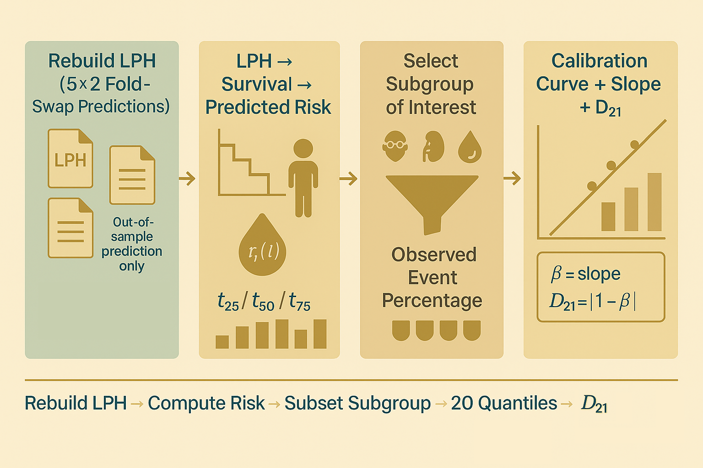

# MCM + CKD B002 — Part 5.2:</br>Using analyse_now for the 5x2 Cross-Validated Calibration Scores



Hey, hello, and Kia Ora!

In [Part 5.1](https://github.com/NicKuo-ResearchStuff/Masked_Clinical_Modelling/tree/main/Blogs/Blogs_X_Implementation/Blog_CKD_UnderstandingB002_Part07), we opened the hood on the `EvalSurv` class in code [B002](https://github.com/NicKuo-ResearchStuff/Masked_Clinical_Modelling/blob/main/Blogs/Blogs0a2_HandsOn(JBIPaper)/2025-11-10_(2025_08_16)_B002_MCM_BaselineAugmentation_JbiSpecialIssue.ipynb) -- the class that turns LPH into predicted survival risk.

Now, in this post, we will discuss the `analyze_now()` function, on how we embed the predicted risk calculation into a 5x2 cross validation setup for fair evaluation of empirical calibrations.

---

## 1. Why Do We Need `analyze_now()`?

Once we have predicted risk from `EvalSurv`, the next task is to answer:</br>
*How well does the model’s risk match reality?*

To do this, we must:</br>
1. rebuild each patient’s risk at chosen horizons (25%, 50%, 75% follow-up)
2. stratify patients by subgroup (age, eGFR, BP, diabetes, etc.)
3. split them into 20 quantiles by predicted risk
4. compute observed event rates within each quantile
5. regress observed vs predicted
6. [obtain the calibration slope and miscalibration score](https://github.com/NicKuo-ResearchStuff/Masked_Clinical_Modelling/tree/main/Blogs/Blogs_X_Implementation/Blog_CKD_UnderstandingB002_Part06)

`analyze_now()` performs this entire workflow -- for original CoxPH (non-augmented) predictions.

Later, Part 5.3 uses the sister function `analyze_now_aug()` to do exactly the same for augmented data.

---

## 2. The Arguments

Here is the function definition:

```python
def analyze_now(Calibration_df, file_suffix, cur_var, cur_value):
```

It takes four inputs:

| Argument         | Meaning                                             |
| ---------------- | --------------------------------------------------- |
| `Calibration_df` | The full dataset with LPH + survival outcomes       |
| `file_suffix`    | String pointing to the saved LPH files (fold-swap)  |
| `cur_var`        | Subgroup variable (*e.g.,* `"Strat_Age"`)             |
| `cur_value`      | Which subgroup level we analyse (*e.g.,* `1 = Older`) |

This lets us evaluate calibration for any subgroup.

---

## 3. Step 1 -- Rebuild Out-of-Sample LPH Predictions

Because of the 5×2 fold-swap cross-fitting, each patient has 10 out-of-sample LPH predictions saved in files such as:

```
CKD_FoldSwap_0_1_original.csv
CKD_FoldSwap_3_0_original.csv
...
```

Inside `analyze_now()`, we load them:

```python
lph_matrix_cox = np.zeros((df_cox.shape[0], num_folds))

for fold in range(num_folds):
    for swap in range(2):
        idx = (Calibration_df[f"FOLD_{fold}"] == swap)
        temp = pd.read_csv(f"CKD_FoldSwap_{fold}_{swap}_{file_suffix}.csv")
        lph_matrix_cox[idx, fold] = temp["LPH"]
```

Each row (patient) receives one LPH per fold, then we take the mean:

```python
df_cox["LPH"] = lph_matrix_cox.mean(axis=1)
```

This reconstructs a smooth, stable prediction for each patient.

---

## 4. Step 2 -- Convert LPH → Risk Using `EvalSurv`

In Part 5.1, we saw how `EvalSurv` reconstructs:</br>
* baseline survival $S_0(t)$
* individual survival $S_i(t)$
* predicted risk $r_i(t)$

Now we use it:

```python
es_cox = EvalSurv(df_cox.copy())
```

We then compute risk at three canonical time points:

```python
time_points = [
    np.percentile(Calibration_df[time_col], 25),
    np.percentile(Calibration_df[time_col], 50),
    np.percentile(Calibration_df[time_col], 75)
]
```

These three horizons capture:</br>
* early, mid, and late follow-up
* different patterns of censoring
* time-varying calibration behaviour

For each time (t):

```python
df_cox["RISK_PERC"] = es_cox.get_risk_perc(at_time=t)
```

This produces true absolute risk predictions for calibration.

---

## 5. Step 3 -- Filter to the Subgroup of Interest

Every subgroup has a binary indicator in `my_df2`, so we apply:

```python
CONDITION = my_df2[cur_var] == cur_value
subset = df_cox.loc[CONDITION].copy()
```

Examples:</br>
* `Strat_Age = 1` → Older adults
* `Strat_eGFR = 0` → Normal kidney function
* `Strat_CVD = 1` → History of cardiovascular disease

This enables calibration-by-subgroup evaluation.

---

## 6. Step 4 -- Quantile Binning: 20 Empirical Calibration Points

```python
subset["QUANTILE"] = pd.qcut(subset["RISK_PERC"], q=20, labels=range(20))
```

This creates 20 equal-sized bins sorted by predicted risk — exactly how most medical papers implement calibration.

For each bin:
* compute mean predicted risk
* count observed events
* convert count → percentage

```python
calibration_data = subset.groupby("QUANTILE").agg({
    "RISK_PERC": "mean",
    "EVENT": "sum"
})
calibration_data["EVENT_PERC"] = calibration_data["EVENT"] / (len(df_cox.index)/20) 100
```

Now we have 20 points for the empirical calibration curve.

---

## 7. Step 5 -- Compute Calibration Slope and $D_{21}$

We fit a regression through the origin:

```python
calibration_slope = compute_calibration_slope(calibration_data)
calibration_error = abs(1 - calibration_slope)
```

Where:</br>
* slope = 1 → perfectly calibrated
* slope < 1 → underprediction
* slope > 1 → overprediction
* $D_{21} = |1 - \beta|$ → magnitude of miscalibration

This pair of numbers summarises the calibration curve.

---

## 8. Summary Diagram

```
        ┌──────────────────────────────────┐
        │ Step 1: Load fold-swap LPH       │
        │ (5×2 out-of-sample predictions)  │
        └──────────────────────────────────┘
                        │
                        ▼
        ┌──────────────────────────────────┐
        │ Step 2: LPH → Risk via EvalSurv  │
        │ r_i(t) for t at 25/50/75 pct     │
        └──────────────────────────────────┘
                        │
                        ▼
        ┌──────────────────────────────────┐
        │ Step 3: Subset target subgroup   │
        │ e.g., Older, Diabetic, Low eGFR  │
        └──────────────────────────────────┘
                        │
                        ▼
        ┌──────────────────────────────────┐
        │ Step 4: 20 Quantile Bins         │
        │ mean predicted risk              │
        │ observed event proportion        │
        └──────────────────────────────────┘
                        │
                        ▼
        ┌──────────────────────────────────┐
        │ Step 5: Calibration Slope        │
        │ and D21 miscalibration score     │
        └──────────────────────────────────┘
```

---

Cheers,</br>
\- Nic

(Last Edit: 2025-11-26)
