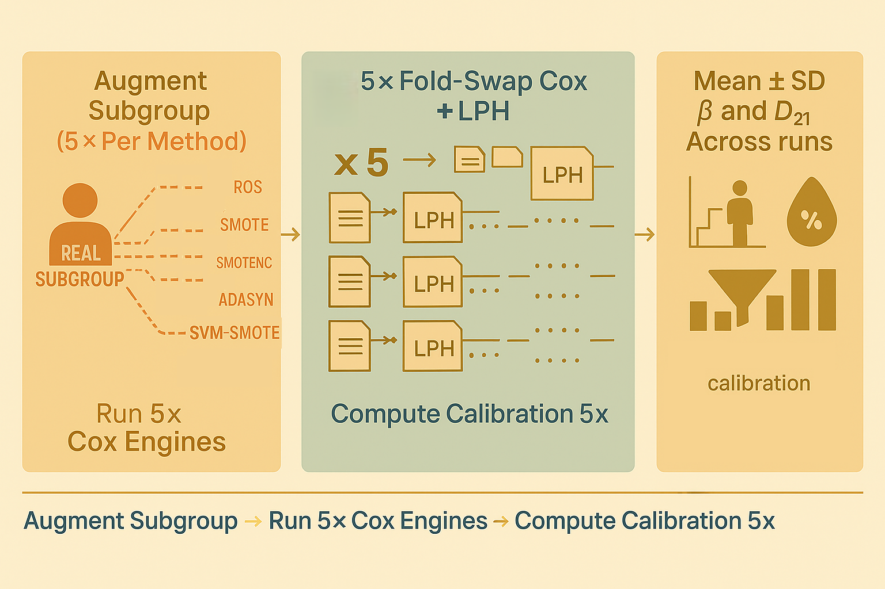

# MCM + CKD B002 — Part 5.3:</br>From One Prediction to Many — Calibration Under Synthetic Augmentation



Hey, hello, and Kia Ora!

In [Part 5.2](https://github.com/NicKuo-ResearchStuff/Masked_Clinical_Modelling/tree/main/Blogs/Blogs_X_Implementation/Blog_CKD_UnderstandingB002_Part08), we dissected the `analyze_now()` function — the version that evaluates calibration using the original (non-augmented) CoxPH predictions across a 5×2 fold-swap engine.

In this post, we examine the sister function:

```python
analyze_now_aug()
```

This function performs the same calibration workflow as the vanilla version but repeated across 5 independently generated synthetic cohorts, producing mean ± SD calibration slopes for every augmentation method and every subgroup.

---

## 1. Why Do We Need `analyze_now_aug()`?

The augmented pipeline asks:</br>
*After adding synthetic versions of this subgroup, how consistently does calibration improve (or worsen)?*

Because each synthetic dataset is stochastically generated, any single calibration run may be misleading.</br>
So B002 repeats the augmentation five times, evaluates each one independently, and reports:
* mean calibration slope
* SD of slope
* mean miscalibration score $|1 - \beta|$
* SD of miscalibration

---

## 2. What Stays the Same?

`analyze_now_aug()` retains all core components from `analyze_now()`:</br>
* the same covariates
* the same survival reconstruction via `EvalSurv`
* the same 25/50/75th percentile horizons
* the same subgroup filters
* the same 20 risk quantiles
* the same regression‐through‐the‐origin calibration slope
* the same miscalibration measure (D_{21} = |1 - \beta|)

The differences come from repetition, ingestion of new LPH files, and aggregation.

---

## 3. The Five-Key Differences

### 0. Wrap everything inside a 5-iteration loop

```python
for itr in range(5):
    ...
```

Each replicate corresponds to:
* a freshly oversampled dataset,
* a full 5×2 fold-swap retraining,
* and a new set of LPH predictions written as:

```
CKD_FoldSwap_<fold>_<swap>_<suffix>_<itr>_<AUG>.csv
```

---

### 3.1. Extract covariates, time, event labels

Same as vanilla -- but done inside the replicate loop.

Each augmented dataset yields its own LPH predictions, so each replicate needs its own `df_cox`.

---

### 3.2.-3.3. Rebuild augmented LPH from fold-swap files

This is the largest change in file handling.

Compared to vanilla:</br>
```
CKD_FoldSwap_<fold>_<swap>_<suffix>.csv
```

The augmented version loads:</br>
```
CKD_FoldSwap_<fold>_<swap>_<suffix>_<itr>_<CUR_AUG>.csv
```

That means:
* same fold dimension
* same swap dimension
* plus:
  * augmentation replicate (`itr = 0…4`)
  * augmentation method (`CUR_AUG = SMOTE, ADASYN, …`)

---

### 3.4.-3.5. LPH averaging + EvalSurv

Both identical to vanilla -- but per replicate:
* each synthetic cohort deserves its own reconstructed baseline survival curve
* and its own predicted risks

---


## 4. Storage changes: collect multiple results

Before entering the replicate loop, we initialise:

```python
Cali_results[t] = []
Dto1_results[t] = []
```

---

## 5. New Final Step -- Aggregate Over Replicates

After getting the predicted risks of all 5 augmented replicates, we summarise:
```python
Cali_mean = mean(Cali_results[t])
Cali_std  = std(Cali_results[t])
Dto1_mean = mean(Dto1_results[t])
Dto1_std  = std(Dto1_results[t])
```

and return:
```
{
   "Cali_mean": ...,
   "Cali_std":  ...,
   "Dto1_mean": ...,
   "Dto1_std":  ...
}
```

---


Cheers,</br>
\- Nic

(Last Edit: 2025-11-28)
