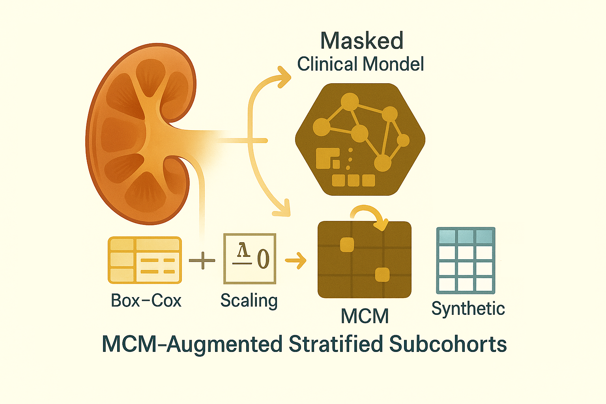

# MCM + CKD — B003 Overview:</br> Same Calibration Engine but Now with MCM Augmentation



Hey, hello, and Kia Ora!

[B003](https://github.com/NicKuo-ResearchStuff/Masked_Clinical_Modelling/blob/main/Blogs/Blogs0a2_HandsOn(JBIPaper)/2025-11-10_(2025_08_16)_B003_MCM_McmAugmentation_JbiSpecialIssue.ipynb) may look like a brand-new workflow, but under the hood it is intentionally structurally identical to [B002](https://github.com/NicKuo-ResearchStuff/Masked_Clinical_Modelling/blob/main/Blogs/Blogs0a2_HandsOn(JBIPaper)/2025-11-10_(2025_08_16)_B002_MCM_BaselineAugmentation_JbiSpecialIssue.ipynb). Everything you learned from the baseline-augmentation pipeline still applies here:</br>
the same stratification, the same leak-free 5×2 fold-swap CoxPH engine, the same EvalSurv-based risk reconstruction, and the same calibration evaluation functions (`analyze_now`, `analyze_now_aug`).

What changes in B003 iso nly one thing:</br>
we swap out classical synthetic data methods (oversampling, copy-paste, noise-jittering) and replace them with the MCM-generated synthetic subcohorts. In other words, B003 keeps the entire experimental and computational scaffolding constant so that the effect of MCM itself can be isolated, quantified, and compared fairly.

Because the focus of this blog is the calibration pipeline, not the generative model, we do not re-explain how MCM works internally. Those details have already been fully covered in the [Implementation series](https://github.com/NicKuo-ResearchStuff/Masked_Clinical_Modelling/tree/main/Blogs) (Implementation 05–09) and the CKD Part 1–2 posts, where we walked through masking strategies, attention reconstruction, Box–Cox scaling, conditional sampling, and the realism utility checks. B003 simply plugs that pre-trained MCM into the same augmentation slots that B002 reserved for classical methods -- nothing more, nothing less.

---

```
1. Load & Structure CKD EMR Data
   ├─ Read "CKD_EHR.csv" into `data`
   ├─ Rename columns → DEM_*, CBM_*, MH_*, MED_*, OUT_* meta-classes
   └─ Reorder columns into a clinically structured table (`my_df`)

2. Continuous Variable Stabilisation (Box–Cox + Scaling)
   ├─ For each selected continuous variable:
   │    ├─ Fit Box–Cox λ on `my_df[col] + 1`
   │    ├─ Store λ, min, range in `transformation_params`
   │    └─ Transform & scale to [0, 1] in `MY_DF`
   └─ Convert `MY_DF` → PyTorch tensor `MY_DF_TENSOR`

3. Train the MCM Model (Attention + MLP Core)
   ├─ Define `AttentionLayer` and `AttentionMLPModel`
   ├─ Wrap data in DataLoader (batch_size = 16)
   ├─ For `epochs = 500`:
   │    ├─ For each batch:
   │    │    ├─ Create feature-wise random mask (10–95% masked per row)
   │    │    ├─ Forward pass: `outputs = model(inputs, mask)`
   │    │    ├─ Loss = MSE on masked entries only
   │    │    └─ Backprop + Adam update
   └─ Result: trained MCM model that reconstructs masked clinical features

4. Define Clinical Stratifications (Same as B002)
   ├─ Copy `my_df` → `my_df2`
   ├─ Create subgroup labels:
   │    ├─ `Strat_Age` (Older vs Younger)
   │    ├─ `Strat_eGFR` (Normal vs Non-Ideal)
   │    ├─ `Strat_Diabetes`, `Strat_Hypertension`, `Strat_BP_Level`
   │    ├─ `Strat_Obesity`, `Strat_CVD`, `Strat_Lipid`
   │    ├─ Final binary flags: `Strat_Dia_Fin`, `Strat_Hyper_Fin`, `Strat_Lipid_Fin`
   ├─ Collapse multi-level labels → binary (0/1) using `convert_to_binary`
   └─ Compute prevalence ratios for each flag → `ratios` dict
       (used to identify under-represented groups)

5. Build Calibration Dataset & Fold-Swap Structure (Same as B002)
   ├─ Select columns:
   │    ├─ `covariate_cols` (19 predictors)
   │    ├─ `time_col` = OUT_TimeToEventMonths
   │    ├─ `event_col` = OUT_EventCKD35
   │    └─ `Strat_col` = all subgroup flags
   ├─ Create `Calibration_df` = covariates + time + event + strat flags
   ├─ For each of 5 folds:
   │    └─ Stratified train_test_split (50/50) → mark FOLD_i = 0 or 1
   └─ Save `Calibration_df` (fold-swap assignment)

6. Baseline CoxPH (No Augmentation) — process_data_base (Same as B002)
   ├─ Set `file_suffix = "original"`
   ├─ For each fold in {0..4}:
   │    ├─ For each swap in {0,1}:
   │    │    ├─ Training = patients with FOLD_i == (1 - swap)
   │    │    ├─ Fit CoxPH (penalizer = 0.01) on:
   │    │    │    └─ covariates + TIME + EVENT
   │    │    ├─ Testing = patients with FOLD_i == swap
   │    │    ├─ Compute LPH for testing set (manual dot product)
   │    │    └─ Save to:
   │    │         "CKD_FoldSwap_{fold}_{swap}_original.csv"
   └─ This gives leak-free baseline LPH for calibration

7. MCM-Generated Synthetic Subcohorts (MCM Swap-In Block)
   ├─ Fix `mask_ratio = 0.5` and set `model.eval()`
   ├─ Initialise `All_Synth_Data_50PC = {}`
   ├─ For each stratification key in `ratios.keys()` (e.g. Strat_Age, Strat_eGFR, …):
   │    ├─ For each subgroup value now01 ∈ {0, 1}:
   │    │    ├─ For each iteration now_cur_itr ∈ {0..4}:
   │    │    │    ├─ Find indices of patients with that strat value (my_df2[Cur_Strat] == now01)
   │    │    │    ├─ Extract those rows from `MY_DF_TENSOR`
   │    │    │    ├─ Create 50% feature mask per row
   │    │    │    ├─ Run MCM:
   │    │    │    │    ├─ `synthetic_output = model(subgroup_tensor, mask)`
   │    │    │    │    └─ Impute masked entries with predicted values
   │    │    │    ├─ Invert scaling + Box–Cox back to original scale
   │    │    │    ├─ Post-process:
   │    │    │    │    ├─ Threshold binary variables at 0.5 → {0,1}
   │    │    │    │    ├─ Round age & time to integers
   │    │    │    │    └─ Round continuous labs/BP/BMI to 2 d.p.
   │    │    │    └─ Store DataFrame in:
   │    │    │         All_Synth_Data_50PC[f"{Cur_Strat}_{now01}_{now_cur_itr}"]
   └─ Output: 5 synthetic subcohorts per (stratification, value) pair, all MCM-generated

8. CoxPH With MCM-Augmented Training Sets — process_data_stratified
   ├─ For each `Cur_Strat` in `ratios.keys()`:
   │    ├─ For each now01 ∈ {0, 1}:
   │    │    ├─ For each now_cur_itr ∈ {0..4}:
   │    │    │    ├─ Cur_keys = "{Cur_Strat}_{now01}_{now_cur_itr}"
   │    │    │    ├─ file_suffix = "augmented_" + Cur_keys
   │    │    │    ├─ For each fold in {0..4}:
   │    │    │    │    ├─ For each swap in {0,1}:
   │    │    │    │    │    ├─ Training = FOLD_i == (1 - swap)
   │    │    │    │    │    ├─ Extract real training data → `tim`
   │    │    │    │    │    ├─ Retrieve synthetic subcohort:
   │    │    │    │    │    │    └─ `synth_data_df = All_Synth_Data_50PC[Cur_keys]`
   │    │    │    │    │    ├─ Build synthetic `tim_synth` (same covariates + TIME + EVENT)
   │    │    │    │    │    ├─ Concatenate:
   │    │    │    │    │    │    └─ `pd.concat([tim, tim_synth])`
   │    │    │    │    │    ├─ Fit CoxPH on combined real + synthetic
   │    │    │    │    │    ├─ Testing = FOLD_i == swap
   │    │    │    │    │    ├─ Compute LPH on testing set
   │    │    │    │    │    └─ Save to:
   │    │    │    │    │         "CKD_FoldSwap_{fold}_{swap}_{file_suffix}.csv"
   └─ This mirrors B002’s augmented Cox path, but with MCM subcohorts instead of SMOTE/ADASYN/etc.

9. EvalSurv: Rebuild Survival & Risk From LPH (Same as B002 Part 5.1)
   ├─ `EvalSurv(df)`:
   │    ├─ Add PARTIAL_HAZARD = exp(LPH)
   │    ├─ Compute baseline survival S₀(t) via grouped cumulative hazards
   │    ├─ get_surv(t): S(t | x) = S₀(t) ^ PARTIAL_HAZARD
   │    ├─ get_risk(t) = 1 − S(t | x)
   │    └─ get_risk_perc(t) = 100 × get_risk(t)

10. Baseline Calibration — analyze_now (Same as B002 Part 5.2)
    ├─ Input: Calibration_df, file_suffix="original", subgroup (cur_var, cur_value)
    ├─ Reassemble out-of-sample LPH:
    │    ├─ Load all "CKD_FoldSwap_*_*_original.csv"
    │    ├─ Average LPH across folds → df_cox["LPH"]
    ├─ Build EvalSurv → risk at 25th, 50th, 75th percentiles of follow-up
    ├─ Within subgroup (cur_var == cur_value):
    │    ├─ Bin into 20 risk quantiles
    │    ├─ For each bin:
    │    │    ├─ Mean predicted RISK_PERC
    │    │    └─ Observed EVENT_PERC
    │    ├─ Fit linear regression (no intercept): EVENT_PERC ~ RISK_PERC
    │    └─ Extract calibration slope + D21 = |1 − slope|
    └─ Return per-timepoint calibration metrics

11. Calibration Under MCM Augmentation — analyze_now_aug (Same as B002 Part 5.3 Shape)
    ├─ Input: Calibration_df, file_suffix="augmented_<Cur_Strat>_<value>", subgroup (cur_var, cur_value)
    ├─ For each iteration itr ∈ {0..4}:
    │    ├─ Reassemble LPH from:
    │    │    └─ "CKD_FoldSwap_*_*_{file_suffix}_{itr}.csv"
    │    ├─ Repeat same EvalSurv + quantile-binning calibration as in analyze_now
    │    ├─ Store calibration slope & D21 at 25th/50th/75th percentiles
    ├─ Aggregate across 5 iterations:
    │    ├─ For each time point:
    │    │    ├─ Cali_mean, Cali_std
    │    │    └─ Dto1_mean, Dto1_std
    └─ Return mean ± SD calibration metrics per time point for the chosen subgroup
```

---

Cheers,</br>
\- Nic

(Last Edit: 2025-12-01)
