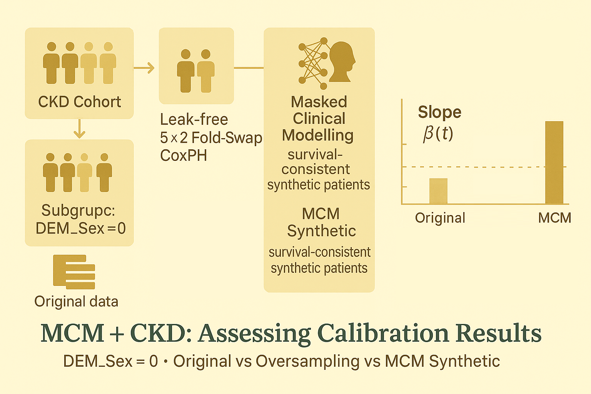

# MCM + CKD: Assessing Calibration Results



Hey, hello, and Kia Ora!

In the earlier CKD posts, we:
* built a leak-free [5×2 fold-swap](https://github.com/NicKuo-ResearchStuff/Masked_Clinical_Modelling/tree/main/Blogs/Blogs_X_Implementation/Blog_CKD_UnderstandingB002_Part03) CoxPH engine,
* defined clinically meaningful [subgroups (age, sex, eGFR, BP, etc.)](https://github.com/NicKuo-ResearchStuff/Masked_Clinical_Modelling/tree/main/Blogs/Blogs_X_Implementation/Blog_CKD_UnderstandingB002_Part02), and
* set up [classical oversampling baselines](https://github.com/NicKuo-ResearchStuff/Masked_Clinical_Modelling/tree/main/Blogs/Blogs_X_Implementation/Blog_CKD_UnderstandingB002_Part01) (RandomOverSampler, SMOTE, ADASYN, …)
* and then swapped them out for [MCM-based synthetic augmentation](https://github.com/NicKuo-ResearchStuff/Masked_Clinical_Modelling/tree/main/Blogs/Blogs_X_Implementation/Blog_CKD_UnderstandingB003_Part01).

In this post, we’ll do something more down-to-earth:</br>
Look at actual calibration numbers and interpret what they mean.

We’ll focus on one subgroup -- `DEM_Sex = 0` -- and walk through:
1. How the calibration code is structured,
2. How classical oversampling compares to MCM Synthetic augmentation in this CKD subgroup.

---

## 1. The Calibration Engine in Code

For each subgroup, the calibration script does three main things:
1. Baseline (original data):</br>
   Evaluate calibration using the out-of-sample CoxPH predictions from the 5×2 fold-swap engine.

2. Baseline + classical synthetic augmentation:</br>
   Evaluate calibration again after augmenting that subgroup using:
   * RandomOverSampler
   * SMOTE
   * SMOTENC
   * ADASYN
   * BorderlineSMOTE
   * SVMSMOTE

3. Baseline + MCM synthetic augmentation:</br>
   Run the same calibration machinery, but now the subgroup has been augmented using MCM-generated synthetic patients, not classical oversampling.

Let’s unpack how that works.

---

### 1.1 Setting Up the Condition

For this example, we lock in:

```python
print("Calibration Condition: DEM_Sex_0")
seed_everything()

cur_var, cur_value = "DEM_Sex", 0
org = "original"
aug = "augmented_DEM_Sex_0"
```

`cur_var = "DEM_Sex"` and `cur_value = 0` tell the code:</br>
* →“Filter to the DEM_Sex = 0 subgroup when computing calibration.”*
* `org = "original"` is the file suffix for non-augmented predictions.
* `aug = "augmented_DEM_Sex_0"` is used to locate the augmented files for this subgroup.

Behind the scenes, this hooks into files like:</br>
* `CKD_FoldSwap_..._original.csv`
* `CKD_FoldSwap_..._augmented_DEM_Sex_0_<METHOD>.csv`

---

### 1.2 Baseline Calibration: Original Data Only

Baseline evaluation is done via:

```python
results_original = analyze_now(Calibration_df, org, cur_var, cur_value)
```

Conceptually, [`analyze_now`](https://github.com/NicKuo-ResearchStuff/Masked_Clinical_Modelling/tree/main/Blogs/Blogs_X_Implementation/Blog_CKD_UnderstandingB002_Part08):
1. Filters to `DEM_Sex == 0`.
2. Uses the fold-swap outputs to get out-of-sample LPH for this subgroup.
3. At several time points (here: 77, 93, 100 months ≈ 25th / 50th / 75th percentile of follow-up), it reports:
     * `calibration_slope = β(t)`
     * `calibration_error = |1 − β(t)|`, also called D21.

So for `DEM_Sex = 0`, we get:

```text
Calibration Condition: DEM_Sex_0

#---
Original Data, Baseline

At time 77.00:
  Calibration Slope: 0.6817
  D21 Score (Calibration Error): 0.3183

At time 93.00:
  Calibration Slope: 0.5397
  D21 Score (Calibration Error): 0.4603

At time 100.00:
  Calibration Slope: 0.4914
  D21 Score (Calibration Error): 0.5086
```

Already, we see:
* Slopes are well below 1 → the model is miscalibrated in this subgroup.
* D21 grows over time, indicating worsening calibration at longer horizons.

---

### 1.3 Classical Augmentation: Oversamplers on DEM_Sex = 0

To benchmark classical methods, the script loops through:

```python
AUG = ["RandomOverSampler", "SMOTE", "SMOTENC",
       "ADASYN", "BorderlineSMOTE", "SVMSMOTE"]

for CUR_AUG in AUG:
    results_augmented = analyze_now_aug(
        Calibration_df,
        file_suffix = aug,
        cur_var     = cur_var,
        cur_value   = cur_value,
        CUR_AUG     = CUR_AUG
    )
    ...
```

[`analyze_now_aug`](https://github.com/NicKuo-ResearchStuff/Masked_Clinical_Modelling/tree/main/Blogs/Blogs_X_Implementation/Blog_CKD_UnderstandingB002_Part09) is like `analyze_now`, but it:
* Reads multiple augmented prediction files (*e.g.,* 5 independent augmentation runs).
* Computes calibration slope & D21 for each run.
* 
Returns mean ± standard deviation across runs:
* `Cali_mean`, `Cali_std`
* `Dto1_mean`, `Dto1_std`

This gives us a distribution of calibration scores under each augmentation strategy, rather than a single point estimate.

---

## 2. The Metrics: Slope and D21, One More Time

Just to anchor the intuition:</br>
* Calibration Slope `β(t)` with predicted risk on the y-axis
  * Ideal: 1.0
  * $<$ 1: predictions are too flat or under-sensitive.
  * $>$ 1: predictions are too extreme or under-dispersed for that subgroup.
* D21 Score `|1 − β(t)|`
  * Ideal: 0.0
  * Larger values = more miscalibration.

When we look at tables or printouts:
* Values like `0.4521 (0.0349)` should be read as
* → mean ± standard deviation over augmentation repeats.

---

## 3. Results for DEM_Sex = 0: Classic Oversamplers vs MCM

Let’s put all numbers for DEM_Sex = 0 into two tables:

---

### 3.1 Calibration Slope (mean ± SD)

(*Higher is better; 1.0 is perfect*)

| Method                  | Time = 77           | Time = 93           | Time = 100          |
| ----------------------- | ------------------- | ------------------- | ------------------- |
| Original (Baseline) | 0.6817              | 0.5397              | 0.4914              |
| RandomOverSampler   | 0.4521 ± 0.0349     | 0.3722 ± 0.0275     | 0.3443 ± 0.0239     |
| SMOTE               | 0.4630 ± 0.0656     | 0.3692 ± 0.0425     | 0.3369 ± 0.0347     |
| SMOTENC             | 0.4904 ± 0.0638     | 0.3988 ± 0.0512     | 0.3704 ± 0.0472     |
| ADASYN              | 0.4727 ± 0.0471     | 0.3763 ± 0.0313     | 0.3430 ± 0.0256     |
| BorderlineSMOTE     | 0.4695 ± 0.0494     | 0.3743 ± 0.0332     | 0.3413 ± 0.0282     |
| SVMSMOTE            | 0.5117 ± 0.0448     | 0.4054 ± 0.0320     | 0.3690 ± 0.0279     |
| MCM Synthetic       | 0.7639 ± 0.0056 | 0.5833 ± 0.0033 | 0.5274 ± 0.0027 |

---

### 3.2 D21 Calibration Error (mean ± SD)

(*Lower is better; 0.0 is perfect*)

| Method                  | Time = 77           | Time = 93           | Time = 100          |
| ----------------------- | ------------------- | ------------------- | ------------------- |
| Original (Baseline) | 0.3183              | 0.4603              | 0.5086              |
| RandomOverSampler   | 0.5479 ± 0.0349     | 0.6278 ± 0.0275     | 0.6557 ± 0.0239     |
| SMOTE               | 0.5370 ± 0.0656     | 0.6308 ± 0.0425     | 0.6631 ± 0.0347     |
| SMOTENC             | 0.5096 ± 0.0638     | 0.6012 ± 0.0512     | 0.6296 ± 0.0472     |
| ADASYN              | 0.5273 ± 0.0471     | 0.6237 ± 0.0313     | 0.6570 ± 0.0256     |
| BorderlineSMOTE     | 0.5305 ± 0.0494     | 0.6257 ± 0.0332     | 0.6587 ± 0.0282     |
| SVMSMOTE            | 0.4883 ± 0.0448     | 0.5946 ± 0.0320     | 0.6310 ± 0.0279     |
| MCM Synthetic       | 0.2361 ± 0.0056 | 0.4167 ± 0.0033 | 0.4726 ± 0.0027 |

---

## 4. MCM Synthetic: Does It Do Better?

Slopes increase from 0.6817 → 0.7639 (time 77), </br>
and are consistently closer to 1 than both:
* the baseline, and
* any classical oversampler.

D21 decreases at all three time points:
* 77 months: 0.3183 → 0.2361
* 93 months: 0.4603 → 0.4167
* 100 months: 0.5086 → 0.4726

Standard deviations are tiny (≪ 0.01), which suggests:
* the improvements are robust across repeats, not a lucky draw.

So for DEM_Sex = 0:
* MCM-based synthetic augmentation actually repairs calibration,
* bringing predicted vs observed risks into closer alignment.

---

## 5. Equity Angle: Why This Matters

Calibration is not just a technical metric -- it has equity implications.

If a subgroup (like `DEM_Sex = 0`) is systematically miscalibrated:
* It may underestimate or overestimate risk in that group.
* That can skew downstream decisions: referrals, follow-up schedules, interventions.
* Fixing calibration in under-represented groups is a step toward more equitable prediction.

What we see here is:
* Classical oversamplers:
  * Treat subgroup augmentation as a geometric / density-balance problem.
  * Do not inherently respect the underlying survival structure.
  * End up worsening calibration.

* MCM synthetic augmentation:
  * Uses masked learning + attention to reconstruct data consistent with the survival process.
  * Preserves hazard relationships while enriching sparse subgroups.
  * Improves calibration without retraining the CoxPH model from scratch.

This is exactly the behaviour we want for survival-aware, fairness-aware synthetic data in real-world EMR settings.

Cheers,</br>
\- Nic (in spirit)

(Last Edit: 2025-12-02)
