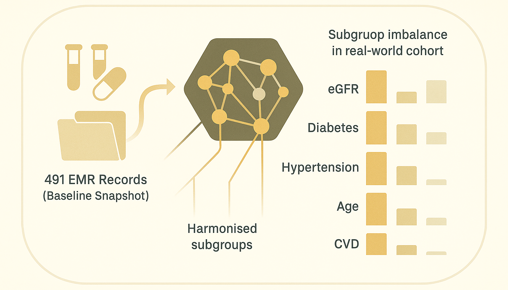

# Chronic Kidney Disease Dataset: Triangulated Cohort and Subgroup Foundations



Hey, hello, and Kia Ora!

In this post, we introduce the Chronic Kidney Disease (CKD) dataset that will serve as a foundation for survival modelling and synthetic augmentation in our Masked Clinical Modelling (MCM) framework.</br>
While small in sample size (491 adults), this dataset has rich clinical structure and clear provenance -- making it ideal for illustrating how contextual, subgroup-aware synthetic data generation can improve calibration and fairness.

---

## Data Provenance

The cohort originates from [Al-Shamsi et al. (2018)](https://journals.plos.org/plosone/article?id=10.1371/journal.pone.0199920), the original longitudinal investigation of chronic kidney disease among adults at high cardiovascular risk in the United Arab Emirates.</br>
Participants were recruited at Tawam Hospital (Al-Ain, UAE) in 2008 and followed for nearly nine years (to June 2017) with quarterly eGFR measurements. The study’s primary outcome was [incident CKD stage 3–5, defined as eGFR < 60 mL/min/1.73 m² sustained ≥ 3 months](https://www.kidneyfund.org/all-about-kidneys/stages-kidney-disease).

A derived baseline extract is publicly available on [Kaggle (Chicco et al. (2022)) with an open license (CC-BY 4.0)](https://www.kaggle.com/datasets/davidechicco/chronic-kidney-disease-ehrs-abu-dhabi), including 491 records × 22 variables, each summarising a patient’s baseline characteristics, medical history, and medication use.</br>

---

## Baseline Structure

| **Category**                            | **Attribute**                          | **Type** | **Median [IQR] or %**    |
| :-------------------------------------- | :------------------------------------- | :------- | :----------------------- |
| **Demographic and Lifestyle Variables** | Age (years)                            | Numeric  | 54.00 [44.00 – 64.00]    |
|                                         | Sex (female)                           | Binary   | 50.92 %                  |
|                                         | Smoking history                        | Binary   | 15.27 %                  |
|                                         | Obesity history                        | Binary   | 50.51 %                  |
| **Clinical Baseline Measurements**      | Total cholesterol (mmol/L)             | Numeric  | 5.00 [4.20 – 5.77]       |
|                                         | Serum creatinine (μmol/L)              | Numeric  | 66.00 [55.00 – 78.50]    |
|                                         | Estimated GFR (mL/min/1.73 m²)         | Numeric  | 98.10 [86.40 – 109.50]   |
|                                         | Systolic blood pressure (mmHg)         | Numeric  | 131.00 [121.00 – 141.00] |
|                                         | Diastolic blood pressure (mmHg)        | Numeric  | 77.00 [69.00 – 83.00]    |
|                                         | Body mass index (kg/m²)                | Numeric  | 30.00 [26.00 – 33.00]    |
| **Medical History**                     | History of diabetes                    | Binary   | 43.79 %                  |
|                                         | History of coronary heart disease      | Binary   | 9.16 %                   |
|                                         | History of vascular disease            | Binary   | 5.91 %                   |
|                                         | History of hypertension                | Binary   | 68.23 %                  |
|                                         | History of dyslipidaemia               | Binary   | 64.56 %                  |
| **Medication Use**                      | Lipid-lowering medication              | Binary   | 55.19 %                  |
|                                         | Diabetes medication use                | Binary   | 32.79 %                  |
|                                         | Blood pressure-lowering medication     | Binary   | 61.71 %                  |
|                                         | ACE inhibitor / ARB use                | Binary   | 44.60 %                  |
| **Follow-up Summary**                   | Overall duration (years)               | Numeric  | 8.00 [6.00 – 8.00]       |
|                                         | Duration with CKD stage 3–5 (years)    | Numeric  | 4.00 [2.00 – 7.00]       |
|                                         | Duration without CKD stage 3–5 (years) | Numeric  | 8.00 [7.00 – 8.00]       |
|                                         | Event rate                             | Binary   | 11.41 %                  |

---

## Triangulation and Derived Subgroups

In order to test the concept of syntehtic data as a service for augmentation, we harmonise the variables therein the CKD EMR through multi-source triangulation -- combining diagnostic flags, medications, and lab measures into coherent binary strata.</br>
This ensures that each subgroup reflects clinical reasoning, not arbitrary thresholds.

```
A. eGFR  →  Renal Function
    ├─ Extract baseline serum creatinine / eGFR.
    ├─ Apply KDIGO threshold:
    │     ≥ 90 mL/min/1.73 m² → “Normal”
    │     < 90 mL/min/1.73 m² → “Non-Ideal”
    └─ Encode as binary: Normal = 0, Non-Ideal = 1.

B. Diabetes  →  Glycaemic Status
    ├─ Check diagnosis history for diabetes mellitus.
    ├─ Verify medication record:
    │     – None → “No Diabetes”
    │     – Diagnosis only → “Diabetes (untreated)”
    │     – Diagnosis + medication → “Diabetes (on treatment)”
    └─ Collapse → binary Diabetes (Yes/No).

C. Hypertension  →  Blood-Pressure Status
    ├─ Identify hypertension diagnoses.
    ├─ Check antihypertensive medication (ACE inhibitor / ARB).
    │     – None → “No Hypertension”
    │     – Diagnosis only → “HTN without medication”
    │     – Diagnosis + ACEi/ARB → “HTN with medication”
    └─ Combine → binary Hypertension (Yes/No).

D. Age  →  Demographic Risk
    ├─ Retrieve age at baseline.
    ├─ Apply threshold:
    │     < 65 yrs → “Younger”
    │     ≥ 65 yrs → “Older”
    └─ Encode as binary Age (Younger/Older).

E. Cardiovascular Disease (CVD) → Comorbidity
    ├─ Review history for:
    │     coronary heart disease, heart failure, stroke,
    │     or peripheral vascular disease.
    ├─ Presence of any → “CVD”
    └─ Else → “No CVD”
       Encode → binary CVD (Yes/No).
```

---

## Stratification and Imbalance

The resulting stratifications show clear class imbalance --  a natural property of real-world CKD populations:

```
──────────────────────────────────────────────────────────────
    eGFR Non-Ideal (↓ function) ............. 32.79 %
    Diabetes (Yes) .......................... 43.79 %
    Hypertension (Yes) ...................... 68.23 %
    Older (≥ 65 yrs) ........................ 22.81 %
    CVD (Yes) ............................... 13.85 %
──────────────────────────────────────────────────────────────
```

These distributions form a realistic testbed for evaluating conditional data augmentation.</br>
Under the MCM framework, we can [generate synthetic records targeted at underrepresented strata](https://github.com/NicKuo-ResearchStuff/Masked_Clinical_Modelling/tree/main/Blogs/Blogs_Z_Implementation/Implementation08) -- *e.g.,* older adults with multi-morbidity -- improving calibration and fairness in survival models.


Cheers,</br>
\- Nic

(Last edit: 2025-11-12)
