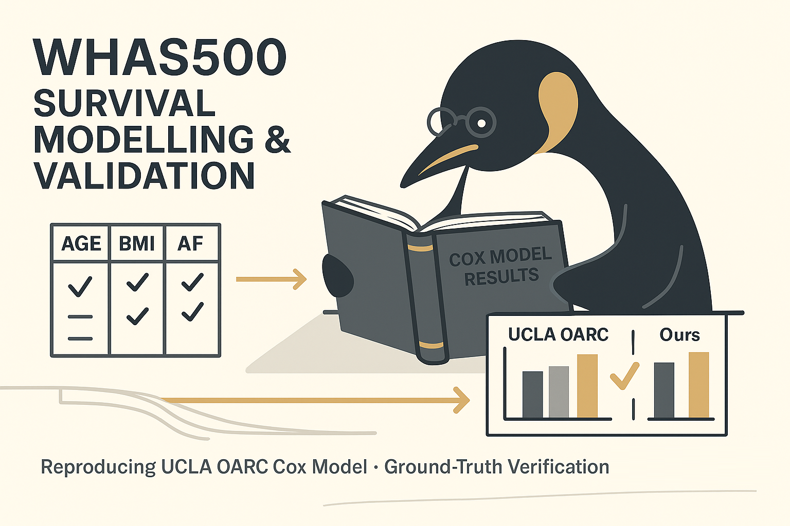

# WHAS500: Classic Survival Analysis and Ground-Truth Validation



Hey, hello, and Kia Ora!

The WHAS500 dataset is well-established, but it can appear in slightly different forms depending on its source and preprocessing steps.
As shown in the [previous post](https://github.com/NicKuo-ResearchStuff/Masked_Clinical_Modelling/tree/main/Blogs/Blogs_Z_Implementation/Implementation01), we used the version available in the `sksurv` Python library.
Here, we’ll reproduce the classic CoxPH model results from [UCLA’s Applied Survival Analysis tutorial](https://stats.oarc.ucla.edu/sas/examples/asa2/) as a sanity check to confirm our dataset and workflow are aligned with the textbook example.


```
WHAS500 dataset ──▶ load & clean ──▶ select key variables
                             │
                             ├─▶ descriptive summary (table)
                             └─▶ ground-truth dataframe (Age, Sex, BMI, SysBP, AF, CHF, …)

───────────────────────────────────────────────────────────────
CLASSIC SURVIVAL ANALYSIS (UCLA OARC)
───────────────────────────────────────────────────────────────
  WHAS500 → apply UCLA transforms (bmifp1, bmifp2, hr10, diasbp10, ga)
         → fit CoxPH model (UCLA spec)
         → compare HR(95% CI) with OARC results (Table 1)

───────────────────────────────────────────────────────────────
EXTENDED ANALYSIS (OUR GROUND-TRUTH)
───────────────────────────────────────────────────────────────
  use clean variables (no scaling)
         → fit CoxPH with all covariates
         → extract HRs + CIs (Table 2)
```

---

## Classic Example: UCLA OARC Replication

To validate our implementation, we followed the well-known example from UCLA’s ffice of Advanced Research Computing (OARC) —
specifically Table 6.7 on page 198 from Hosmer et al. (2008).

In their workflow, WHAS500 was first transformed to prepare numeric predictors for the Cox model:

```python
# --- UCLA OARC (Chapter 6) style transforms in Python ---
import pandas as pd

# starting from our tidy DataFrame `df` with columns:
# BMI, Heart Rate, DiasBP, Age, Sex (0/1), CHF (0/1), Duration (days), Event (0/1)
df = df.copy()

# time in years
df["lenyrs"]   = df["Duration"] / 365.25

# fractional polynomial terms for BMI
df["bmifp1"]   = (df["BMI"] / 10.0) ** 2
df["bmifp2"]   = (df["BMI"] / 10.0) ** 3

# 10-unit scalings
df["hr10"]     = df["Heart Rate"] / 10.0
df["diasbp10"] = df["DiasBP"]     / 10.0

# interaction: gender × age  (Sex: 0=female, 1=male consistent with WHAS500)
df["ga"]       = df["Sex"] * df["Age"]

# optional exclusion used in the textbook example
df_ucla = df.loc[df["DiasBP"] != 198].copy()

```

The OARC specification included:
bmifp1, bmifp2, age, hr10, diasbp10, gender, chf, ga

We refit the same model using `lifelines.CoxPHFitter` and confirmed near-identical hazard-ratio estimates.

| Variable | HR (95 % CI) UCLA OARC |  HR (95 % CI) Ours |
| :------- | :--------------------- | -----------------: |
| bmifp1   | 0.504 (0.358, 0.709)   |  0.50 (0.36, 0.71) |
| bmifp2   | 1.156 (1.070, 1.249)   |  1.16 (1.07, 1.25) |
| AGE      | 1.061 (1.044, 1.079)   |  1.06 (1.04, 1.08) |
| hr10     | 1.129 (1.066, 1.197)   |  1.13 (1.07, 1.20) |
| diasbp10 | 0.885 (0.826, 0.948)   |  0.88 (0.83, 0.95) |
| GENDER   | 6.282 (0.961, 41.070)  | 6.33 (0.97, 41.37) |
| CHF      | 2.294 (1.720, 3.060)   |  2.30 (1.72, 3.07) |
| ga       | 0.973 (0.950, 0.996)   |  0.97 (0.95, 1.00) |

---

## Extended Analysis: Naive Full Model

If we extend the predictor set to include more clinical detail and removed the artificial scaling, we get:

| Variable                       |      HR (95 % CI) |
| :----------------------------- | ----------------: |
| Age                            | 1.05 (1.04, 1.06) |
| BMI                            | 0.96 (0.93, 0.99) |
| Sex (Female vs Male)           | 0.76 (0.57, 1.01) |
| Heart Rate                     | 1.01 (1.00, 1.02) |
| SysBP                          | 1.00 (0.99, 1.01) |
| DiasBP                         | 0.99 (0.98, 1.00) |
| CVD (M True vs False)          | 1.01 (0.71, 1.43) |
| AF (M True vs False)           | 1.14 (0.81, 1.59) |
| CHF (M True vs False)          | 2.17 (1.62, 2.91) |
| MI Order (Recurrent vs First)  | 1.04 (0.78, 1.40) |
| MI Type (Q-wave vs non Q-wave) | 0.85 (0.59, 1.23) |

---

## Wrapping Up

Now that we have re-established the classic UCLA results, we confirm that our WHAS500 source and processing pipeline are correct.
Only then can we confidently use this ground truth as the baseline for the MCM synthetic and augmented data generation.

In the next post, we’ll briefly cover CoxPH models for those familiar with ML but not with epidemiology.

Cheers,</br>
\- Nic

(Last edit: 2025-10-17)
