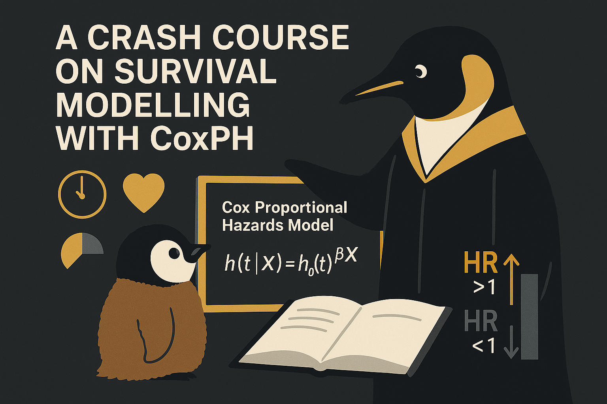

# A Crash Course on Survival Modelling with CoxPH

  

Hey, hello, and Kia Ora!

If you’ve ever tried to predict outcomes in medicine -- who relapses, who improves, and when things happen -- you’ve already touched the edge of survival analysis.
Unlike ordinary regression, survival models care not just about what happens, but when.

In this post, we’ll take a quick tour through what Cox Proportional Hazards (CoxPH) model is, why it matters, and how it connects traditional statistics with modern machine learning and synthetic data frameworks like MCM.

---

## Purpose of Survival Modelling

Survival modelling aims to estimate the time until an event -- such as death, relapse, or readmission -- occurs.
It doesn’t just say who is at risk; it quantifies how that risk evolves over time.

Unlike binary classifiers that say "yes" or "no", survival models explicitly handle time and incomplete data -- for example, patients who are still alive when the study ends.
These "incomplete" cases are known as censored observations, and survival analysis can naturally accommodate them.

| Type           | Focus                     | Question                                              | Example                                  |
| -------------- | ------------------------- | ----------------------------------------------------- | ---------------------------------------- |
| Diagnostic | Determines current status | “Does this patient have diabetes now?”              | Glucose test predicting disease presence |
| Prognostic | Predicts future outcome   | “Given current health, when might the event occur?” | Predicting 5-year mortality after MI     |

---

## The Role of Time and Censoring

Every survival dataset has two key columns:

* Duration (T): how long each patient was followed (days, months, years).
* Event (E): whether the event occurred (1) or was censored (0).

Censoring doesn’t mean missing data; it simply means "we stopped watching before the event occurred".
Each row represents one patient’s follow-up time, event indicator, and predictors such as age, sex, or comorbidities.

```
ID | Duration | Event | Age | Sex | BMI | AF | CHF | ...
```

---

## The CoxPH Model in a Nutshell

CoxPH models the hazard, or instantaneous risk, at any time t as:

$h(t|X) = h_0(t) \exp(\beta_1 X_1 + \beta_2 X_2 + ... + \beta_p X_p)$

Note how CoxPH is just a linear regression -- on log-hazards, where:

* $h(t|X)$ = hazard at time t for someone with covariates X
* $h_0(t)$ = baseline hazard (common to all)
* $\beta_i$ = effect of variable ($X_i$)
* $\exp(\beta_i)$ = hazard ratio (HR), i.e., the multiplicative change in risk

CoxPH is semi-parametric -- it doesn’t assume a fixed shape for $h_0(t)$, making it flexible yet interpretable.

For the model to work as intended, a few key assumptions must hold:
1. Proportional Hazards: The relative risk between two people is constant over time.
2. Linearity in Log-Hazard: The log of the hazard depends linearly on the predictors.
3. Independent Censoring: The reason someone is censored is unrelated to their risk.
4. Independent Observations: Each individual’s data is independent of others.

Each coefficient ($\beta_i$) in CoxPH maps directly to a clinical variable -- there are no hidden layers or abstract embeddings.
Exponentiating it ($e^{\beta_i}$) gives the hazard ratio (HR), which tells you how much that variable changes risk, holding others constant.

This makes CoxPH one of the most interpretable models in medicine.

---

## The Concept of the Hazard Ratio (HR)

$HR = e^{\beta}$
* HR = 1.0 → no effect
* HR > 1.0 → increased risk
* HR < 1.0 → decreased (protective) effect

Example:
If (HR = 1.5) for male, then men have a 50% higher instantaneous risk of the event compared to women, at any given time.

Confidence intervals around HRs express uncertainty:

| HR & 95% CI                  | Interpretation                     |
| ---------------------------- | ---------------------------------- |
| Both < 1 (*e.g.,* 0.70–0.90)   | Significant protective effect      |
| Both > 1 (*e.g.,* 1.20–1.50)   | Significant risk-increasing effect |
| Includes 1 (*e.g.,* 0.95–1.20) | Not statistically significant      |

If a CI crosses 1, the effect could be due to chance.
This helps determine which factors are clinically relevant and which may be noise.

---

## Modelling CoxPH with lifelines

[`lifelines`](https://lifelines.readthedocs.io/en/latest/) is a Python library that makes survival modelling approachable.
It abstracts away the math and lets you focus on interpretation.

```python
from lifelines import CoxPHFitter

cph = CoxPHFitter()
cph.fit(my_df, duration_col='Duration', event_col='Event')
cph.summary
```

---

## Comparing Real vs Synthetic Data

Once both real and synthetic datasets are ready, fitting a CoxPH model to each allows you to test whether the clinical signal has been preserved.

If both models produce similar HRs and CIs, it means the synthetic data retains the same relationships between variables and outcomes -- the essence of clinical realism.

---

## Wrapping Up

In the next post, we will discuss the steps to fit a CoxPH model, and demonstrate how to plot the HRs.

Cheers,</br>
\- Nic

(Last Edit: 2025-10-20)
