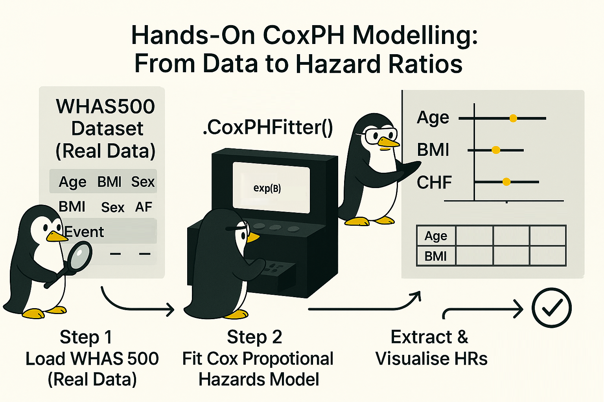
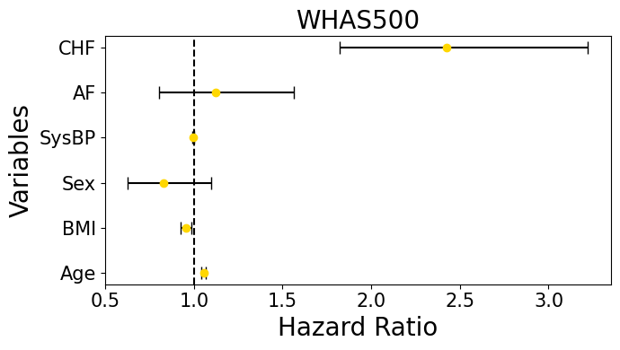

# Hands-On CoxPH Modelling: From Data to Hazard Ratios



Hey, hello, and Kia Ora!

Thus far, we have discussed [WHAS500](https://github.com/NicKuo-ResearchStuff/Masked_Clinical_Modelling/tree/main/Blogs/Blogs_Z_Implementation/Implementation02) and [CoxPH](https://github.com/NicKuo-ResearchStuff/Masked_Clinical_Modelling/tree/main/Blogs/Blogs_Z_Implementation/Implementation03); now, let us apply some useful codes that we can later help us evaluate the clinical realism of synthetic data.

```
┌───────────────────────────────────────────────┐
│ 1) INITIALISE MODEL                           │
├───────────────────────────────────────────────┤
│ from lifelines import CoxPHFitter             │
│ cph = CoxPHFitter()                           │
└───────────────────────────────────────────────┘
                     │
                     ▼
┌─────────────────────────────────────────────────┐
│ 2) FIT MODEL TO DATA                            │
├─────────────────────────────────────────────────┤
│ cph.fit(                                        │
│     df,                                         │
│     duration_col='Duration',                    │
│     event_col='Event'                           │
│ )                                               │
│ → Estimates β coefficients for each covariate.  │
└─────────────────────────────────────────────────┘
                     │
                     ▼
┌───────────────────────────────────────────────┐
│ 3) EXTRACT RESULTS                            │
├───────────────────────────────────────────────┤
│ cph.summary                                   │
│   • ‘exp(coef)’ → hazard ratios (HRs)         │
│   • ‘exp(coef) lower 95%’ / ‘upper 95%’ → CIs │
└───────────────────────────────────────────────┘
                     │
                     ▼
┌───────────────────────────────────────────────┐
│ 4) VISUALISE (outside lifelines)              │
├───────────────────────────────────────────────┤
│ Plot HRs ± 95% CI using matplotlib error bars.│
└───────────────────────────────────────────────┘
```

---

## Load and Prepare the Data

We will load the dataset using the `load_whas500()` function.

```python
from sksurv.datasets import load_whas500
import pandas as pd, copy

seed_everything()

x, y = load_whas500()
df_x = pd.DataFrame(x)
df_y = pd.DataFrame(y, columns=['fstat', 'lenfol'])
combined_df = pd.concat([df_x, df_y], axis=1)

Selected_predictors = [
    'age', 'bmi', 'gender', 'hr',
    'sysbp', 'diasbp', 'cvd', 'afb', 'chf',
    'miord', 'mitype', 'fstat', 'lenfol'
]
combined_df = combined_df[Selected_predictors]

combined_df.rename(columns={
    'age': 'Age', 'bmi': 'BMI', 'gender': 'Sex', 'hr': 'Heart Rate',
    'sysbp': 'SysBP', 'diasbp': 'DiasBP', 'cvd': 'CVD',
    'afb': 'AF', 'chf': 'CHF', 'miord': 'MI Order',
    'mitype': 'MI Type', 'lenfol': 'Duration', 'fstat': 'Event'
}, inplace=True)

my_df = copy.copy(combined_df)
my_df["Event"] = my_df["Event"].astype(int)
for cCol in my_df.columns:
    my_df[cCol] = my_df[cCol].astype(float)
```

|  Age |      BMI | Sex | Heart Rate | SysBP | DiasBP | CVD |  AF | CHF | MI Order | MI Type | Event | Duration |
| ---: | -------: | --: | ---------: | ----: | -----: | --: | --: | --: | -------: | ------: | ----: | -------: |
| 83.0 | 25.54051 | 0.0 |       89.0 | 152.0 |   78.0 | 1.0 | 1.0 | 0.0 |      1.0 |     0.0 |   0.0 |   2178.0 |
| 49.0 | 24.02398 | 0.0 |       84.0 | 120.0 |   60.0 | 1.0 | 0.0 | 0.0 |      0.0 |     1.0 |   0.0 |   2172.0 |
| 70.0 | 22.14290 | 1.0 |       83.0 | 147.0 |   88.0 | 0.0 | 0.0 | 0.0 |      0.0 |     1.0 |   0.0 |   2190.0 |
| 70.0 | 26.63187 | 0.0 |       65.0 | 123.0 |   76.0 | 1.0 | 0.0 | 1.0 |      0.0 |     1.0 |   1.0 |    297.0 |
| 70.0 | 24.41255 | 0.0 |       63.0 | 135.0 |   85.0 | 1.0 | 0.0 | 0.0 |      0.0 |     1.0 |   0.0 |   2131.0 |

---

## Fit the CoxPH Model

We will fit the model using the `CoxPHFitter(A, B, C)`, with `A` the clinical covariates defined, `B`, the time to event defined, and `C` the outcome specified. 

```python
from lifelines import CoxPHFitter

cph = CoxPHFitter()

cph.fit(
    my_df[['Age', 'BMI', 'Sex', 'SysBP', 'AF', 'CHF', 'Duration', 'Event']],
    duration_col='Duration',
    event_col='Event'
)
```

---

## Extract Hazard Ratios (HRs) and Plot

Last, we will access information stored in `cph.summary` to help us plot the CI of the HRs.

```python
import matplotlib.pyplot as plt
import numpy as np

hr = cph.summary['exp(coef)']
ci_lower = cph.summary['exp(coef) lower 95%']
ci_upper = cph.summary['exp(coef) upper 95%']

hr_lower_err = abs(hr - ci_lower)
hr_upper_err = abs(ci_upper - hr)
xerr_real = np.array([hr_lower_err.values, hr_upper_err.values])

fig, ax = plt.subplots(figsize=(7, 4))
ax.errorbar(hr, hr.index, xerr=xerr_real,
            fmt='o', color='gold', ecolor='black', capsize=5)
ax.axvline(x=1, color='black', linestyle='--')
ax.set_title('WHAS500', fontsize=20)
ax.set_xlabel('Hazard Ratio', fontsize=20)
ax.set_ylabel('Variables', fontsize=20)
plt.tight_layout()
plt.show()
```



| Covariate | exp(coef) | Lower 95% CI | Upper 95% CI |
| --------- | --------- | ------------ | ------------ |
| Age   | 1.06  | 1.04         | 1.07         |
| BMI   | 0.96  | 0.93         | 0.99         |
| Sex   | 0.83  | 0.63         | 1.10         |
| SysBP | 1.00  | 0.99         | 1.00         |
| AF    | 1.12  | 0.81         | 1.56         |
| CHF   | 2.42  | 1.82         | 3.22         |

---

## Wrapping Up
In this post, we walked through the full workflow -- from fitting a CoxPH model to plotting its hazard ratios and confidence intervals.
These steps form the downstream verification pipeline that we’ll use later to evaluate our synthetic data generated by MCM.

When we reproduce this same analysis on synthetic cohorts, we’ll directly compare their hazard ratio estimates with those from the real WHAS500 data.
If the two show strong concordance, it means our synthetic data successfully preserves the clinical realism and risk structure of the original cohort.

In the next post, we’ll dive into the inner workings of MCM -- how the model learns to reconstruct and generate survival-aware synthetic data.

Cheers,</br>
\- Nic

(Last edit: 2025-10-21)
