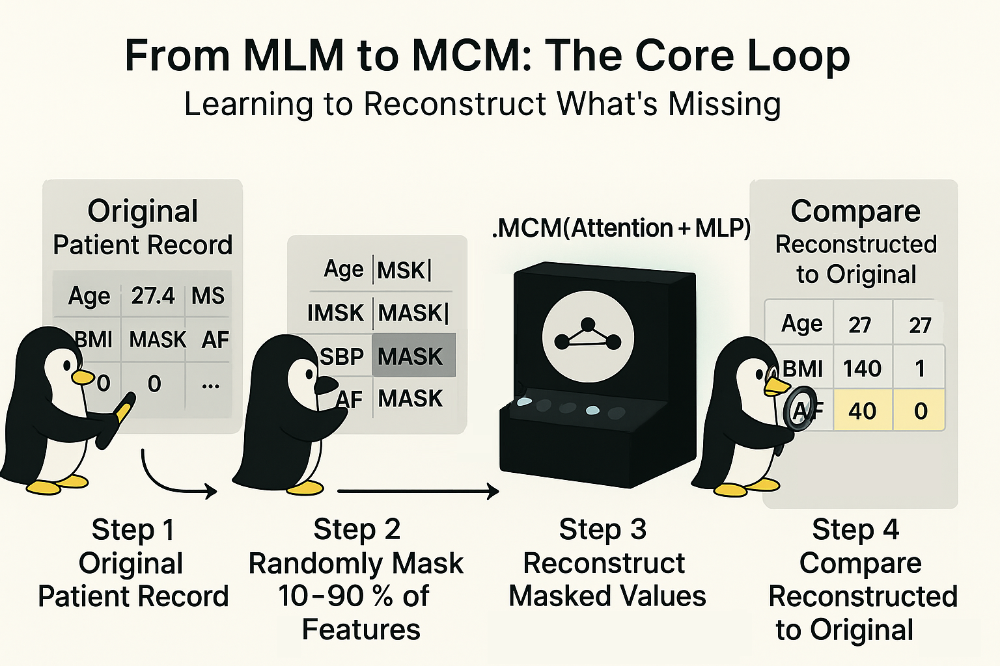

# From MLM to MCM: The Core Loop



Hey, hello, and Kia Ora!

In the last post, we wrapped up our foundation on Cox Proportional Hazards (CoxPH) modelling and learned how to interpret hazard ratios.
Now, let's discuss the philosophy behind Masked Clinical Modelling (MCM), and how its training logic is borrowed from [BERT’s Masked Language Modelling (MLM)](https://arxiv.org/abs/1810.04805).

---

## Masking + Reconstruction

Both BERT and MCM learn through a simple yet powerful idea: *Hide part of the input and train the model to predict what’s missing.*

In BERT, the "input" is text, & in MCM, it is structured clinical data:

| Aspect             | Masked Language Modelling (MLM, from BERT)                | Masked Clinical Modelling (MCM, ours)       |
| ---------------------- | --------------------------------------------------------- | ---------------------------------------------------------- |
| Input modality     | Sequentialtext tokensforming a sentence               | Tabularclinical featuresforming a patient record       |
| Basic unit         | Token (word, subword, punctuation)                        | Feature (*e.g.,* Age, SysBP, AF, CHF, BMI …)                 |
| Context type       | Left + right linguistic context within a sentence         | Cross-feature clinical context within one patient          |
| Masking strategy   | Randomly hide ≈ 15 % of tokens, predict them from context | Randomly hide ≈ 10–90 % of feature values per row          |
| Model backbone     | Transformer encoder with self-attention layers            | Lightweight Attention + MLP             |
| Objective function | Cross-entropy loss on masked token predictions            | Mean-squared (or L1) loss on masked-feature reconstruction |
| Goal of learning   | Learn contextualisedsemantic embeddingsof words       | Learn contextualisedclinical embeddingsof variables    |


Both the MLM and MCM never see the full picture; it must reason from context.
Attention learns to weigh the useful clues among observed inputs.
The reconstruction loss (token vs feature) pushes the network to model dependencies.

---

## The Training Loop in Plain Sight

The same logic drives both worlds.
Below is a task-agnostic outline of MCM’s core loop -- you can think of it as "BERT for tabular data".

```
┌─────────────────────────────────────────────────────────────┐
│                     TRAINING  EPOCH                         │
└─────────────────────────────────────────────────────────────┘
        │
        ▼
┌─────────────────────────────────────────────────────────────┐
│ 1)  Get next batch  X ∈ ℝ[B, F]                             │
│     • B: batch size,  F: number of features                 │
└─────────────────────────────────────────────────────────────┘
        │
        ▼
┌─────────────────────────────────────────────────────────────┐
│ 2)  Create binary mask M ∈ {0,1}^[B,F]                      │
│     • Randomly set a portion of entries to 0 (masked)       │
│     • 1 = observed, 0 = hidden                              │
└─────────────────────────────────────────────────────────────┘
        │
        ▼
┌─────────────────────────────────────────────────────────────┐
│ 3)  Forward pass                                            │
│     • Model(X, M) → Ŷ (reconstructed features)              │
│     • Use attention on visible inputs (M=1)                 │
└─────────────────────────────────────────────────────────────┘
        │
        ▼
┌─────────────────────────────────────────────────────────────┐
│ 4)  Compute loss only on masked positions                   │
│     L = MSE( (1−M)⊙Ŷ, (1−M)⊙X )                           │
└─────────────────────────────────────────────────────────────┘
        │
        ▼
┌─────────────────────────────────────────────────────────────┐
│ 5)  Backpropagate and update weights                        │
│     • optimizer.zero_grad() → loss.backward() → step()      │
└─────────────────────────────────────────────────────────────┘
        │
        ▼
┌─────────────────────────────────────────────────────────────┐
│ 6)  Report epoch loss → repeat next batch or epoch          │
└─────────────────────────────────────────────────────────────┘
```

---

## Intuition Check

Think of each row as asentence about a patient:</br>
*This patient [mask] Age = ?, Sex = ?, but has high SysBP and CHF = 1.*

By asking the model to fill in the blanks, we let it learn the joint structure among variables.
That same learned structure later powers imputation, synthesis, and conditional augmentation -- all without explicit labels.

---

## Wrapping Up

In the next blog, we will inspect the attention + MLP neural network modules.

Cheers,</br>
\- Nic

(Last edit: 2025-10-27)
