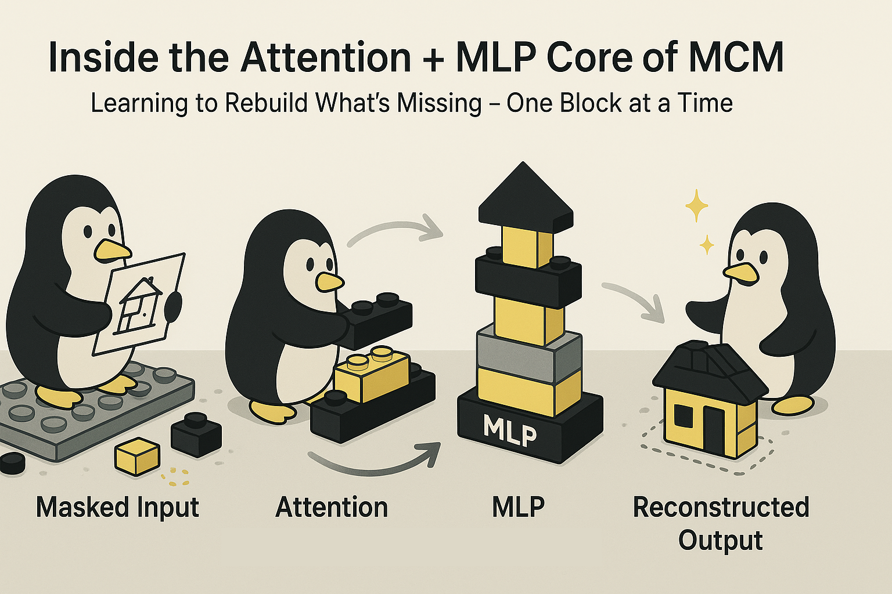

# Inside the Attention + MLP Core of MCM



Hey, hello, and Kia Ora again!

In the [last post](https://github.com/NicKuo-ResearchStuff/Masked_Clinical_Modelling/tree/main/Blogs/Blogs_Z_Implementation/Implementation05), we looked at how MCM borrows its learning philosophy from BERT -- masking a portion of the input and asking the model to predict what’s missing.
Now, let’s zoom in on how that actually happens inside the network.

---

## The Work Hose

At the heart of MCM lies a simple but expressive architecture: an Attention + MLP pair.
The attention layer decides which observed features are usefulfor reconstructing what’s missing.
The MLP then uses that contextualised information to predict the hidden values.

Both layers operate directly on a fully numeric feature space -- every variable is represented as a continuous channel between 0 and 1 -- which ensures that the model can treat all inputs uniformly, regardless of whether they began life as blood pressure readings or binary flags.

---

## Components at a Glance

In the [code](https://github.com/NicKuo-ResearchStuff/Masked_Clinical_Modelling/blob/main/Blogs/Blogs0a1_HandsOn(MedInfoPaper)/2025-10-15_(2025_03_12)_MCM_WHAS500(Small)_MedInfo2025.ipynb), you will find:

| Module              | Role                                                               | Key Operations                                                                                           |
| ------------------- | ------------------------------------------------------------------ | -------------------------------------------------------------------------------------------------------- |
| Attention Layer | Learns per-feature importance conditioned on the visible data.     | Linear projection →</br> mask invalid positions →</br> softmax across features →</br> element-wise weighting of inputs. |
| MLP Head        | Maps the attention-weighted features to predicted reconstructions. | Linear →</br> ReLU →</br> Linear →</br> Sigmoid.                                                                        |

and the associated hyperparameters are

| Symbol / Name                        | Meaning                                               |
| ------------------------------------ | ----------------------------------------------------- |
| `input_dim` = number of features (F) | Input and output dimensionality.                      |
| `hidden_dim = 64`                    | Width of the MLP’s hidden layer.                      |

and it flows like:

```
[Batch X  (B×F)] ──► [Mask M  (B×F)]
           │
           ▼
   ┌────────────── Attention ───────────────┐
   │ A = Linear(X) → Masked(−∞) → Softmax   │
   │ W = attention weights per feature      │
   │ X_att = W ⊙ X  (contextual features)  │
   └────────────────────────────────────────┘
                     │
                     ▼
        ┌──────────── MLP ─────────────┐
        │ H = ReLU(X_att·W1+b1)        │
        │ Ŷ = Sigmoid(H·W2+b2)         │
        └──────────────────────────────┘
                     │
                     ▼
       [Reconstructed output Ŷ  (B×F)]
                     │
                     ▼
       Loss = MSE((1−M)⊙Ŷ, (1−M)⊙X)
```

---

## Wrapping Up

In the next blog, we’ll take a step back from the network internals and look closely at the data pre-processing and post-processing pipelines that make this uniform treatment possible.

Cheers,</br>
\- Nic

(Last edit: 2025-10-28)
