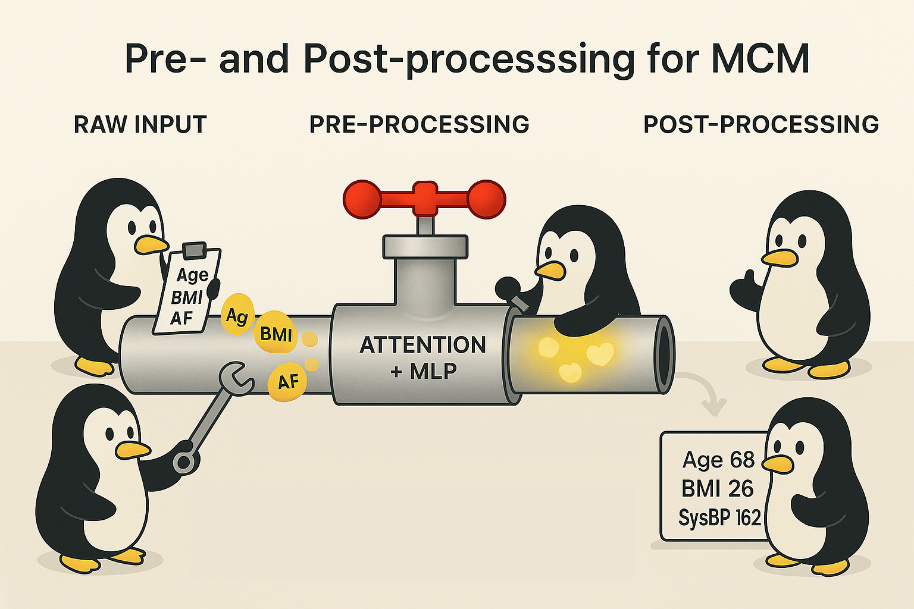

Pre- and Post-Processing for MCM



Hey, hello, and Kia Ora again!

In the [last post](https://github.com/NicKuo-ResearchStuff/Masked_Clinical_Modelling/tree/main/Blogs/Blogs_Z_Implementation/Implementation06), we discussed the Attention + MLP backbone that learns to reconstruct missing values within a fully numeric feature space.

But to make that possible, the data itself needs to be prepared appropriately using pre-processing and post-processing.

---

## Why This Matters

MCM treats every feature -- whether it’s age, BMI, systolic blood pressure, or a yes/no indicator like atrial fibrillation — as a continuous numeric channel between 0 and 1.
That uniformity is what allows a single neural head to handle both physiological and binary data without type-specific encoders.

To achieve this, we need two carefully mirrored transformations:

1. Pre-processing: real-world → numeric tensor
2. Post-processing: numeric tensor → realistic record

---

## Pre-processing:

Each input record contains a mix of continuous and binary variables.
Before the model can learn from them, we normalise all variables into a comparable numeric space.

| Variable Type | Example Variables    | Transformation                                     | Resulting Range    |
| ------------- | -------------------- | -------------------------------------------------- | ------------------ |
| Numeric   | Age, BMI, SysBP      | Box–Cox(y+1; λ) → subtract shift → divide by scale | Continuous ∈ [0,1] |
| Binary    | Sex, AF (M), CHF (M) | Cast to float (0.0 / 1.0)                          | Discrete ∈ {0,1}   |

All six variables -- Age, BMI, Sex, SysBP, AF (M), CHF (M) -- are then concatenated into a unified tensor:

```
X ∈ [0,1]^(B×F)
```

This makes every column maskable, reconstructable, and compatible with the same loss function.

```
[Raw clinical table: Age, BMI, Sex, SysBP, AF (M), CHF (M)]
                     │
                     ▼
   ┌────────────── Pre-processing ───────────────┐
   │ Numeric vars (Age, BMI, SysBP):             │
   │   Box–Cox(y+1; λ) → subtract shift → scale  │
   │   → smoothed, variance-stabilised values    │
   │   → range ≈ [0,1]                           │
   │ Binary vars (Sex, AF, CHF):                 │
   │   Cast to float (0.0 / 1.0)                 │
   │   → remain within [0,1]                     │
   └─────────────────────────────────────────────┘
                     │
                     ▼
             [Model: Attention + MLP]
```

---

## Post-processing: From Numeric Tensor Back to Clinical Record

After the model predicts reconstructed values (Ŷ ∈ [0,1]), we reverse the transformations to obtain interpretable patient-level data.

| Variable Type | Example Variables    | Inverse Transformation                        | Output Example                  |
| ------------- | -------------------- | --------------------------------------------- | ------------------------------- |
| Numeric   | Age, BMI, SysBP      | (ŷ × scale) + shift → inverse Box–Cox → round | Age ≈ 68, BMI ≈ 26, SysBP ≈ 152 |
| Binary    | Sex, AF (M), CHF (M) | Threshold at 0.5 (or Bernoulli sampling)      | 0 = Female, 1 = Male            |

This ensures every reconstructed feature is returned to its clinical unit and semantics.


```
             [Model output: Ŷ ∈ [0,1]^(B×F)]
                     │
                     ▼
   ┌────────────── Post-processing ───────────────┐
   │ Numeric vars (Age, BMI, SysBP):              │
   │   value = (ŷ × scale) + shift                │
   │   → inverse Box–Cox(value; λ)                │
   │   → round + clamp to clinical ranges         │
   │   e.g., 0.32 → Age ≈ 68 yrs                  │
   │ Binary vars (Sex, AF, CHF):                  │
   │   Threshold > 0.5 (or Bernoulli sampling)    │
   │   → convert to integer 0/1                   │
   └──────────────────────────────────────────────┘
                     │
                     ▼
   [Output: interpretable clinical record]
   Age = 68 yrs  BMI = 26  SysBP = 152 mmHg
   Sex = 0 (Female)  AF(M)=1  CHF(M)=0
```

---

## How Pre-/Post-Processing Impacts Model Design

While this may seem like a minor detail, pre- & post-processing can actually impact how we design the backbone.

In our case, the uniform scaling enables shared learning; and since every feature lies within [0,1], a single Sigmoid output head can model all columns simultaneously.

---

## Wrapping Up

In the next blog, we will discuss how we employ a pre-trained MCM to generate synthetic data.

Cheers,</br>
\- Nic

(Last edit: 2025-10-29)
