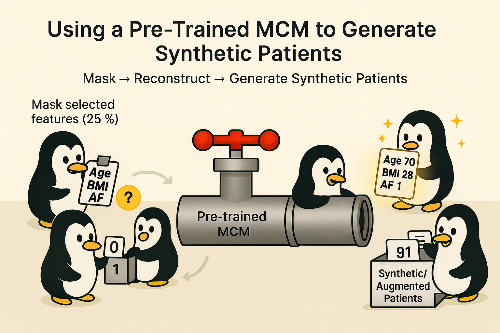

# Using a Pre-Trained MCM to Generate Synthetic Data



Hey, hello, and Kia Ora,

In the [previous post](https://github.com/NicKuo-ResearchStuff/Masked_Clinical_Modelling/tree/main/Blogs/Blogs_Z_Implementation/Implementation07), we wrapped up the full data pipeline around the MCM core -- showing how clinical variables are pre-processed into a unified numeric space and then post-processed back into interpretable patient records.

Let us now employ this pipeline to generate synthetic data.

---

## Step-by-Step: Applying a Pre-Trained Model

Below is a simplified version of the workflow we use to apply a trained MCM to the WHAS500 dataset:

```python
# Create a copy of the original data
synth_df_MLM = copy.copy(MY_DF)

# Convert to tensor and move to GPU
synth_data_tensor = torch.tensor(synth_df_MLM, dtype=torch.float32).to(device)

# Set model to evaluation mode
model.eval()

# Create a mask (1 = keep, 0 = hide)
mask = torch.ones_like(synth_data_tensor).to(device)

# Randomly hide 25% of each row
mask_ratio = 0.25
for i in range(synth_data_tensor.size(0)):
    num_to_mask = int(synth_data_tensor.size(1) mask_ratio)
    mask_indices = random.sample(range(synth_data_tensor.size(1)), num_to_mask)
    mask[i, mask_indices] = 0

# Predict the masked values
with torch.no_grad():
    synthetic_output = model(synth_data_tensor, mask)

# Combine observed + reconstructed values
synth_data_tensor = mask synth_data_tensor + (1 - mask) synthetic_output
```

This short block captures the entire philosophy of MCM: It generates conditionally, not randomly.

---

### Start with a copy of the real data

We begin from a legitimate dataset such as WHAS500 -- the model requires context to generate coherent records.
Each row represents a real patient, but after masking, only part of that information remains.

### Apply random or designed masking

Masking determines which features the model will regenerate.</br>
For example:</br>
masking 25 % of columns → partial synthesis</br>
masking 100 % → fully synthetic generation

Each time the model fills these masked gaps, it reconstructs feature values consistent with the unmasked context.

### Forward pass through the trained model

During inference, MCM acts like acontextual completion engine -- the attention layer identifies which visible features are most informative, and the MLP predicts plausible replacements for the hidden ones.

### Merge back into a completed dataset

The reconstructed and observed values are combined, creating a hybrid table that blends empirical and model-generated information.

---

## Privacy and Applicability

It’s important to note that this current MCM workflow weaves between real and synthetic data.
Because we start from true clinical records and only replace selected features, some genuine patient information remains.

That means MCM, in its present form, is suitable only for:</br>
openly available benchmark datasets (like WHAS500), or</br>
use within [trusted research environments (TREs)](https://research.unsw.edu.au/erica) where secure data handling is enforced.

---

## Beyond Random Masking: Targeted and Conditional Augmentation

One of MCM’s strengths is that the mask can be deliberately designed, not just random.

This makes it possible to create:</br>
Targeted data augmentation -- generate more samples for specific subgroups.</br>
Example:keep Sex = 1 (male) and AF = 1 fixed, mask the rest to create additional male patients with atrial fibrillation.</br>
Conditional generation -- generate patients conditioned on desired attributes (*e.g.,* older age, high BMI).</br>
By holding those features unmasked and regenerating the rest, MCM produces consistent synthetic records within the desired strata.

```python
# Example: generate 1000 synthetic female patients aged 70–75
mask[:, SEX_COL] = 1      # keep Sex fixed
mask[:, AGE_COL] = 1      # keep Age fixed
```

This is different from oversampling (which simply duplicates cases) and different from interpolation (as in MICE), because the model:</br>
learns non-linear dependencies between variables,</br>
generatesnew combinationsof features never seen together,</br>
and conditions these predictions on the real clinical context.

### Comparison with Classical Techniques

| Technique                           | Mechanism                                                  | Limitation                                  | How MCM Differs                                                 |
| ----------------------------------- | ---------------------------------------------------------- | ------------------------------------------- | --------------------------------------------------------------- |
| Oversampling / SMOTE            | Replicates or linearly interpolates minority-class samples | No new structure; can distort distributions | MCM generates new feature combinationsusing learned context  |
| MICE / Regression Imputation    | Predicts missing features via linear models                | Deterministic, weak at non-linear patterns  | MCM learnsnon-linear, context-dependent relationships        |
| MCM (Masked Clinical Modelling) | Masks and reconstructs features via neural attention       | Requires base data (privacy constraint)     | Enables conditional, feature-level synthesis and augmentation |

---

## Wrapping Up

In the next post, we’ll take these generated datasets and evaluate them -- comparing how well synthetic data preserve the statistical structure of the real dataset.

Cheers,</br> 
\- Nic

(Last edit: 2025-10-30)
