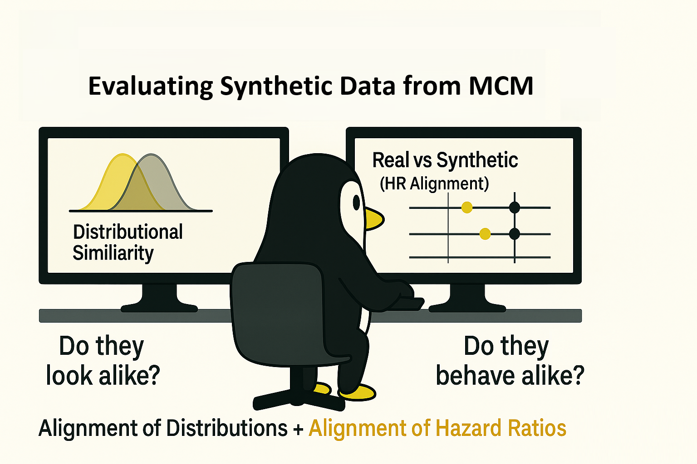

# Evaluating Synthetic Data from MCM



Hey, hello, and Kia Ora,

In the [previous post](https://github.com/NicKuo-ResearchStuff/Masked_Clinical_Modelling/tree/main/Blogs/Blogs_Z_Implementation/Implementation08), we used a pre-trained MCM to generate synthetic clinical records from the WHAS500 dataset. Now that we have produced these synthetic datasets, it’s time to assess:</br>
How closely do they resemble the real data -- both statistically and clinically?

---

## The Evaluation Workflow

At a high level, the evaluation process compares real and synthetic datasets across multiple layers of fidelity:
from basic structure, to variable distributions, to survival relationships.

```
[ Pre-trained MCM ]
        │
        ▼
[ Mask → Reconstruct ]
        │
        ▼
[ Synthetic Dataset ]
        │
        ├─────────────────────────────┐
        │                             │
        ▼                             ▼
[ Real Data ]                 [ Synthetic Data ]
        │                             │
        └──────→  Evaluation Suite  ←─┘
                        │
                        ├─ Schema & Sanity
                        │   • Columns, dtypes, value ranges
                        │
                        ├─ Univariate Marginals
                        │   • KDE / histograms for numeric
                        │   • Bar charts for binary/categorical
                        │
                        ├─ Correlations
                        │   • Pairwise ΔR or rank correlations
                        │
                        └─ Survival Structure (CoxPH)
                            • Compare Hazard Ratios (HRs) ±95% CIs
                            • Align direction, magnitude, and significance
```

---

## Two Complementary Dimensions of Realism

There are two distinct yet complementary ways to assess whether the synthetic data are “realistic”:</br>
1. Distributional Similarity –</br>
   Do individual variables and their pairwise relationships look similar?</br>
   (*e.g.,* same mean, variance, shape, correlation structure)</br>
2. Hazard-Ratio Alignment –</br>
   Do the same clinical factors predict risk in the same way?</br>
   (*e.g.,* same HR direction, magnitude, and confidence pattern)

These two lenses capture different notions of fidelity:</br>
i. Distributional similarity reflects statistical realism (data look plausible).</br>
ii. [HR](https://github.com/NicKuo-ResearchStuff/Masked_Clinical_Modelling/tree/main/Blogs/Blogs_Z_Implementation/Implementation04) alignment reflects clinical utility (data behave plausibly).

---

## What We Look For in HR Alignment

When fitting a CoxPH model on both datasets, each variable’s Hazard Ratio (HR) and 95% Confidence Interval (CI) should tell a consistent story:

| Comparison Outcome                                                 | Interpretation                                                       |
| ------------------------------------------------------------------ | -------------------------------------------------------------------- |
| HR<sub>real</sub> ≈ HR<sub>synth</sub> (CIs overlap)               | Relationship preserved — synthetic data mirrors real clinical signal |
| HR<sub>real</sub> ≈ HR<sub>synth</sub> (direction same, CIs wider) | Partial preservation — same qualitative pattern, lower certainty     |
| HR<sub>real</sub> opposite sign to HR<sub>synth</sub>              | Inversion of effect — loss of clinical interpretability              |
| CI crosses 1.0 only in synthetic data                              | Weaker statistical evidence but not necessarily distortion           |

So, alignment means not just similar point estimates, but also overlapping confidence intervals that exclude contradictory effects.

---

## Distributional Comparisons

We start simple.</br>
Each variable is plotted for both datasets:</br>
Numeric variables → kernel density curves (KDEs) showing how values are distributed.</br>
Binary variables → side-by-side bar charts comparing proportions.</br>

If these shapes overlap, the synthetic dataset captures the overall structure of the real one.

---

## Clinical Alignment via CoxPH

Next, both real and synthetic datasets are fitted with Cox Proportional Hazards models using [`lifelines`](https://github.com/NicKuo-ResearchStuff/Masked_Clinical_Modelling/tree/main/Blogs/Blogs_Z_Implementation/Implementation03).

Each model yields a set of HRs and 95% CIs.</br>
We visualise them side-by-side to see whether the synthetic data reproduce the same survival patterns. A close match indicates that synthetic data maintain the underlying cause–effect structure -- the holy grail for clinical data synthesis.


Cheers,</br>
\- Nic

(Last edit: 2025-10-31)
