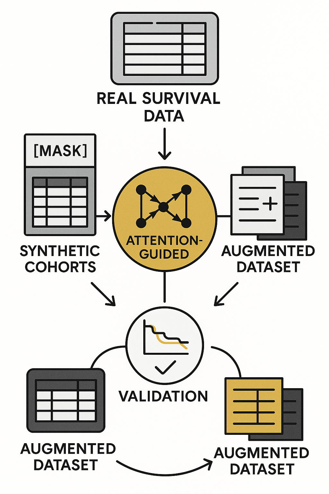

# MCM Implementation Series

Hey, hello, and Kia Ora!

Welcome to the Implementation Series of Masked Clinical Modelling (MCM) -- where we turn concepts into code and ideas into reproducible pipelines.

This is where we walk through the inner mechanics of MCM step by step: how masking, attention, and reconstruction come together to generate survival-aware synthetic and augmented data that preserve key clinical signals.

---

## What is this series?

If you’ve seen the main MCM overview, you already know the philosophy behind the framework.
Here, we zoom in to the hands-on layer -- showing exactly how real survival tables become masked inputs, how the model learns to reconstruct missing features, and how those outputs are validated for realism, calibration, and fairness.

---

## Posts in the Series

### [Implementation 01: Data 101: WHAS500 Data Preparation](https://github.com/NicKuo-ResearchStuff/Masked_Clinical_Modelling/tree/main/Blogs/Blogs_Z_Implementation/Implementation01)

This is a walkthrough of the WHAS500 heart-attack survival cohort, where we show its data characteristics.

### [Implementation 02: Data 102: WHAS500: Classic Survival Analysis and Ground-Truth Validation](https://github.com/NicKuo-ResearchStuff/Masked_Clinical_Modelling/tree/main/Blogs/Blogs_Z_Implementation/Implementation02)

In this post, we replicate UCLA’s WHAS500 CoxPH results to verify that the dataset introduced in Implementation 01 is consistent and reliable.

### [Implementation 03: A Crash Course on Survival Modelling with CoxPH](https://github.com/NicKuo-ResearchStuff/Masked_Clinical_Modelling/tree/main/Blogs/Blogs_Z_Implementation/Implementation03)

This is a quick introduction to Cox Proportional Hazard (CoxPH) models, explaining how survival models handle time and censoring, and to interpret their hazard ratios.

### [Implementation 04: Hands-On CoxPH Modelling: From Data to Hazard Ratios](https://github.com/NicKuo-ResearchStuff/Masked_Clinical_Modelling/tree/main/Blogs/Blogs_Z_Implementation/Implementation04)

This is a practical walkthrough showing how to fit a Cox Proportional Hazards model with lifelines, extract hazard ratios, and plot confidence intervals.

### [Implementation 05: From MLM to MCM: The Core Loop](https://github.com/NicKuo-ResearchStuff/Masked_Clinical_Modelling/tree/main/Blogs/Blogs_Z_Implementation/Implementation05)

A conceptual bridge between BERT’s masked language modelling and MCM’s masked clinical modelling, showing how the same mask-and-reconstruct training loop teaches a model to infer missing clinical features from context.

### [Implementation 06: Inside the Attention + MLP Core of MCM](https://github.com/NicKuo-ResearchStuff/Masked_Clinical_Modelling/tree/main/Blogs/Blogs_Z_Implementation/Implementation06)

A quick walkthrough of how MCM’s Attention + MLP core reconstructs masked clinical features through contextual weighting and nonlinear prediction.

### [Implementation 07: Pre- and Post-Processing for MCM](https://github.com/NicKuo-ResearchStuff/Masked_Clinical_Modelling/tree/main/Blogs/Blogs_Z_Implementation/Implementation07)

A hands-on walkthrough on the necessary preparations before and after the modelling steps.

### [Implementation 08: Using a Pre-Trained MCM to Generate Synthetic Data](https://github.com/NicKuo-ResearchStuff/Masked_Clinical_Modelling/tree/main/Blogs/Blogs_Z_Implementation/Implementation08)

A demonstration showing how a pre-trained MCM model generates synthetic clinical data by masking, reconstructing, and conditionally augmenting real patient records.

### [Implementation 09: Evaluating Synthetic Data from MCM](https://github.com/NicKuo-ResearchStuff/Masked_Clinical_Modelling/tree/main/Blogs/Blogs_Z_Implementation/Implementation09)

A walkthrough of how MCM-generated synthetic data are evaluated for statistical realism and clinical utility.

### [MCM + CKD Part 1: From Kaggle CSV to MCM-Ready EMR Table](https://github.com/NicKuo-ResearchStuff/Masked_Clinical_Modelling/tree/main/Blogs/Blogs_X_Implementation/Blog_CKD_UnderstandingB001_Part01)

A step-by-step walkthrough of how we transform a raw CKD baseline dataset into a clean, clinically structured, Box–Cox-stabilised, MCM-ready tensor for masked learning.

### [MCM + CKD Part 2: Does Synthetic CKD Data Behave Like the Real Thing?](https://github.com/NicKuo-ResearchStuff/Masked_Clinical_Modelling/blob/main/Blogs/Blogs_X_Implementation/Blog_CKD_UnderstandingB001_Part02)

A set of validations showing that MCM-generated synthetic CKD baselines closely match real data in distributions, correlations, survival curves, and CoxPH hazard ratios.

### [MCM + CKD — Baseline Augmentation Overview: How Well Do Classical Oversampling Methods Improve Calibration?](https://github.com/NicKuo-ResearchStuff/Masked_Clinical_Modelling/tree/main/Blogs/Blogs_X_Implementation/Blog_CKD_UnderstandingB002_Part01)

We outline the code that we used to benchmark classical oversampling approaches for CKD subgroup augmentation to test how far they can push CoxPH calibration -- before bringing MCM into the picture.

### [MCM + CKD B002 — Part 1: Stratifying the CKD Cohort for Calibration](https://github.com/NicKuo-ResearchStuff/Masked_Clinical_Modelling/tree/main/Blogs/Blogs_X_Implementation/Blog_CKD_UnderstandingB002_Part02)

This blog explains how we turn raw CKD EMR variables into clinically meaningful binary subgroup flags.

(Last Edit: 2025-11-18)
